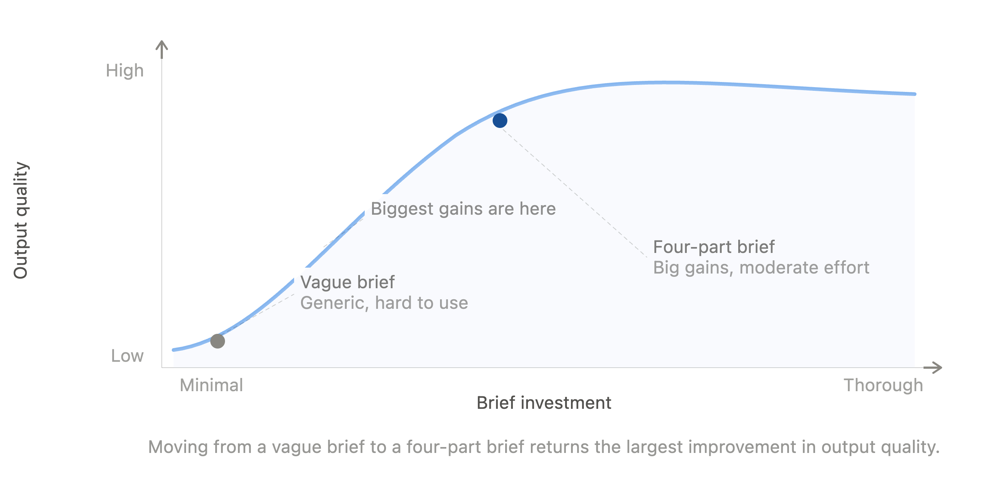
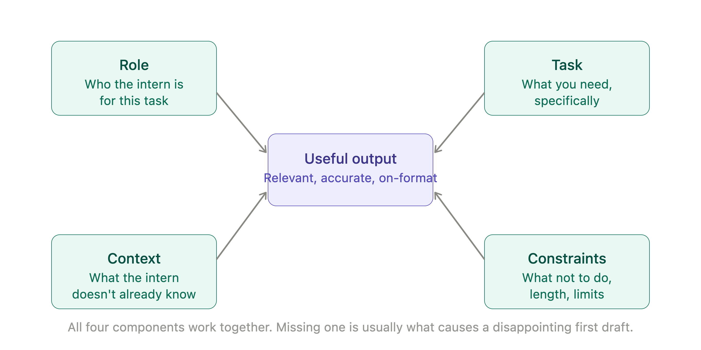
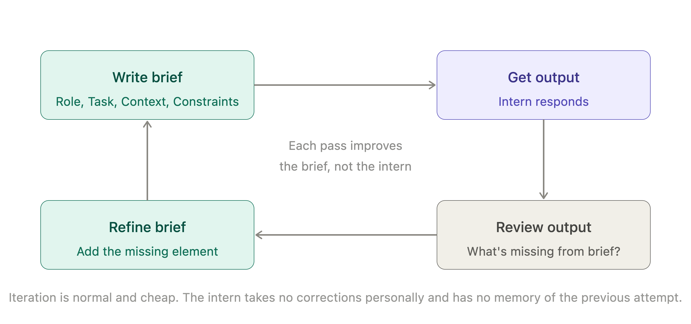

# Chapter 2: The Briefing Room

Most managers discover quickly that their Digital Intern is capable of producing very different quality work depending on how they are asked. The same intern who delivers a sharp, well-structured analysis in one conversation produces something vague and generic in another. The task was similar. The intern was the same. What changed was the quality of the brief.

This is not a coincidence. It is the central mechanic of working with generative AI and understanding it puts a manager in control of the output in a way that feels, at first, almost surprising. The intern does not improve with time and experience the way a human employee does. What improves and what you can deliberately improve is how clearly you tell them what you need.

That is what this chapter is about. Not the technology behind the brief — but the craft of writing one well.

## The Brief Is the Work

In most management contexts, the brief is the thing you do before the work. You write the brief, hand it off and then the work begins. With your Digital Intern, the relationship is different. The brief does not precede the work — it largely determines it. A vague brief produces vague output. A brief that specifies the audience, the purpose, the format and the constraints produces output that is useful from the first attempt.

This shifts something important. Managers who approach AI as a time-saving tool — type a quick request, get an answer — often find the output disappointing and conclude that the technology is overhyped. Managers who treat the brief as the primary investment of their attention find something closer to the opposite. The intern handles the volume. The manager handles the direction. And the quality of the direction is almost entirely within the manager's control.

The good news is that briefing a Digital Intern draws on skills most managers already have. Clarity. Specificity. An understanding of the audience. A clear sense of what success looks like. These are not new skills. What is new is applying them to a conversation with a piece of software.

*Figure 2-1. Brief Investment vs Output Quality.*

> **MARGIN — The Investment**
> *With your Digital Intern, the brief is where your attention goes. A two-minute brief produces two-minute output. A ten-minute brief that clearly specifies the task, the audience, the format and what good looks like will return that investment many times over.*

## Role, Task, Context, Constraints

A useful brief has four components. Not all four are needed for every task — a simple request can be simple — but when the output disappoints, the missing element is almost always one of these.

**Role.** Tell the intern who they are for this task. Not their general identity, but their role in this specific conversation. *You are a communications advisor helping a senior manager prepare for a difficult team meeting.* This does two things: it narrows the scope of the intern's knowledge to what is relevant and it sets a register — the tone and style appropriate to that role. An intern asked to respond as a communications advisor will write differently from one asked to respond as a legal analyst, even to an identical underlying question.

**Task.** State what you need, specifically. Not *help me with the report* but *write a one-page executive summary of the attached report, in plain English, for a board audience with no technical background*. The more specific the task, the more precisely the intern can direct their considerable fluency at the right target.

**Context.** Provide the information the intern does not have. This is the information that lives inside your organisation — your company's situation, your client's preferences, the history of the project, the audience's particular sensitivities. The intern's general knowledge is broad. What it lacks is your specific knowledge. Context is how you supply it.

**Constraints.** Tell the intern what not to do, or what the limits are. *No longer than 300 words. Avoid technical jargon. Do not recommend a specific vendor.* Constraints save rounds of revision. Without them, the intern will make plausible choices about format and scope — and plausible is not always right.

*Figure 2-2. The Four-Part Brief.*

> **MARGIN — The Four-Part Brief**
> *Role, Task, Context, Constraints. For routine tasks, one or two of these will do. For anything important, use all four. The brief takes five minutes. The revision it saves you takes much longer.*

## Talking to the Intern Like a Manager

There is a temptation, when writing instructions to an AI system, to become either too formal — as though writing a specification document — or too casual, as though sending a text message. Neither works especially well.

The register that works best is the one a good manager uses when briefing a capable person: direct, specific and respectful of the recipient's intelligence. You do not need to explain the obvious. You do not need to soften the request. You do not need to say please, though it does no harm. What you need to do is say clearly what you want, give the intern the information they need to produce it, and specify the form you want it in.

A useful test: read the brief back and ask whether a capable, well-intentioned person with no prior knowledge of your organization or the situation could produce what you need from it. If not, something is missing.

> **MARGIN — The Capable Stranger Test**
> *Before sending a brief, ask: could a capable stranger, given only this instruction and nothing else, produce what I need? If the answer is no, the brief is incomplete. Add the missing context before sending.*

## Iteration Is Not Failure

Most managers find that their first attempt at a brief does not produce exactly what they wanted. This is not a sign that the technology does not work, or that they are doing it wrong. It is the normal pattern of working with any capable collaborator on a complex task.

The intern does not take corrections personally. They do not remember the previous attempt in a new session. They do not become defensive when asked to try again with different parameters. This makes iteration genuinely cheap — cheaper, in many respects, than iterating with a human colleague who has invested effort in the first version.

When the output is not right, the question to ask is not *what did the intern do wrong* but *what did the brief not specify*. In most cases, the second brief — which adds the missing element, narrows the scope or corrects a misunderstood constraint — produces something substantially better. The quality of output improves not because the intern learns, but because the manager's brief gets more precise.

*Figure 2-3. The Iteration Loop.*

> **MARGIN — Why It Missed**
> *When the output is not what you needed, read the brief rather than the output. The gap between what you asked for and what you got is almost always in the brief. Add the missing element and try again.*

## Giving the Intern a Persona

One of the more powerful techniques available in a brief is asking the intern to take on a specific perspective or expertise for the task. This goes beyond role — it asks the intern to filter their response through a particular viewpoint.

*Respond as a sceptical CFO reviewing this business case for the first time.* The intern will apply what they know about how CFOs think, what they prioritize and what objections they tend to raise. The result is a stress test of the business case — not a perfect one, but a useful one, produced in seconds.

*Review this proposal as if you were a procurement manager from a regulated financial services firm.* The intern will flag the kinds of concerns that procurement in that sector tends to raise: compliance questions, vendor risk, data handling, contractual protections. Again, not a substitute for real procurement review — but a useful first pass that surfaces questions worth thinking about before the real review happens.

The technique works because the intern has encountered a great deal of text written by, about and for a wide range of professional roles and perspectives. Asking them to adopt a perspective is asking them to draw on a relevant portion of that reading.

> **MARGIN — The Devil's Advocate**
> *Ask the intern to argue against your proposal before you present it. Give them the brief, then ask: what would a sceptical board member say? What has been missed? What would concern a cautious CFO? The objections are worth having before the meeting, not during it.*

## What Belongs in the Brief, and What Does Not

There are things that should always go into a brief, and things that are a waste of space.

**Include:** the audience for the output, the purpose it will serve, the form you want it in, the length or scope, any specific information the intern needs that they would not otherwise have and any constraints on what the output should or should not contain.

**Exclude:** background about how AI works, assurances that the intern is capable of the task, lengthy explanations of why you are asking and social pleasantries that would not appear in a well-written internal memo. The intern does not need encouragement. They need information.

One thing that catches managers out: asking for too many things in a single brief. A brief that asks the intern to summarise a document, identify the three key risks, draft a response and suggest a meeting agenda is four tasks presented as one. The intern will attempt all four and the result will be adequate across all of them rather than excellent on any one. Better to sequence the tasks, treating each as a separate brief that builds on what came before.

> **MARGIN — One Task at a Time**
> *A brief that contains four tasks produces four adequate outputs. Four briefs, each with one task, produce four good ones. Sequence your requests. The intern has no problem with the extra work — and neither will you, once you see the difference in quality.*

## The Brief as an Organizational Asset

Individual managers who learn to brief their Digital Intern well get better output. Organizations that treat good briefs as an asset — documenting them, sharing them, refining them over time — get something more valuable: consistency.

A well-crafted brief for a recurring task is reusable. The brief that produces a good first draft of a board paper is the same brief, with different context plugged in, next quarter. The brief that produces useful competitor summaries can be shared across a team. The brief that generates useful risk checklists for a particular type of project can become a standard part of the project toolkit.

This is an organizational skill, not just an individual one. Teams that develop a shared library of effective briefs find that the quality of AI output across the team rises — not because the intern has improved, but because the organization has become better at directing it.

> **MARGIN — The Reusable Brief**
> *A brief that works once can work every time. When a brief produces genuinely useful output, save it. Strip out the specific context, leave the structure and the constraints, and you have a template. That template is an asset.*

## Chapter Summary

- The quality of your Digital Intern's output is largely determined by the quality of the brief. This is within your control.
- A useful brief has four components: role, task, context and constraints. For complex tasks, use all four.
- Write the brief as you would instruct a capable person with no prior knowledge of the situation — specific, direct, complete.
- When output disappoints, the problem is almost always in the brief, not the intern. Add the missing element and try again.
- Asking the intern to adopt a specific perspective or persona is a powerful way to generate useful challenges and stress tests.
- Keep briefs focused on a single task. Sequence multiple requests rather than bundling them.
- Effective briefs are reusable. A brief that works once can become a team asset.

*Next: Chapter 3 — Supervising the Intern: Trust, Safety and Governance*
