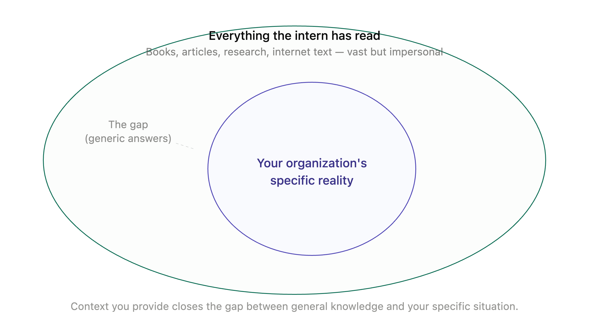
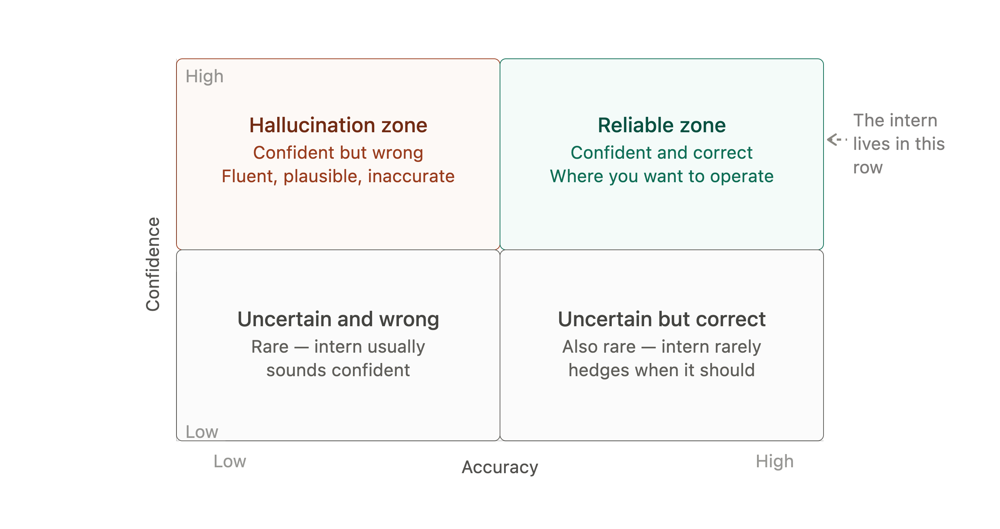
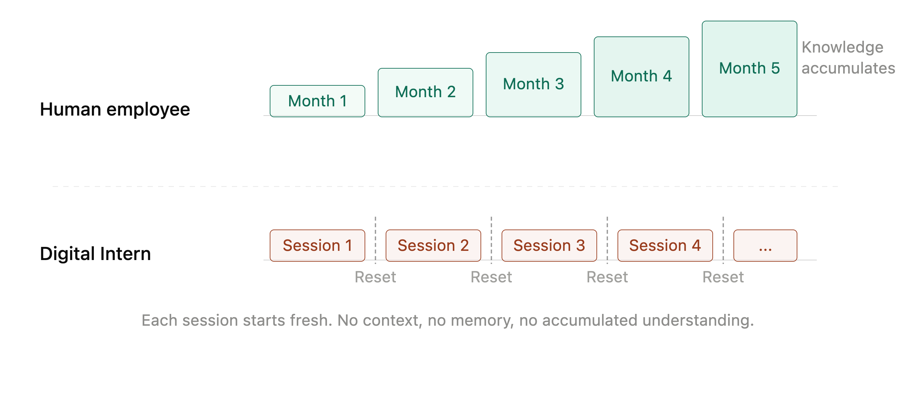

# Chapter 1: What Your Digital Intern Actually Knows

> **MARGIN — The Briefing Room**
> *A consistent thread runs through every margin in this book. You have just hired a Digital Intern. Brilliant, tireless, eager to help — and in need of careful management. Each margin note translates the chapter's ideas into what they mean for you, the manager, on your first week with a new member of staff.*

Something unusual happened in the last few years. A technology arrived that was immediately useful to almost everyone, required no training to try and produced results good enough to be surprising. Managers who had spent careers carefully avoiding the technical details of the systems they oversaw found themselves using one directly, often before their IT departments had formed a policy about it.

The result is a peculiar situation. Executives are approving AI budgets, signing off on AI initiatives and fielding questions from boards about AI strategy — while privately unsure whether they understand the thing they are being asked to govern. This is uncomfortable and it need not be.

You do not need to know how a large language model works to manage one effectively. You do need to know what it is like to work with one — its habits, its tendencies, its characteristic strengths and its equally characteristic failures. That is what this chapter is for.

## The Intern Who Read Everything

Imagine you have hired an intern. Before their first day, this intern spent several years reading. Not casually — comprehensively. They read books, articles, research papers, contracts, instruction manuals, court judgments, recipes, technical specifications and an enormous quantity of text from the internet. By the time they arrive at your desk, they have encountered more written material than any human being could absorb in a lifetime.

The result is genuinely impressive. Ask them to draft a client email and they will produce something polished. Ask them to summarise a long document and they will pull out the key points accurately. Ask them to explain a technical concept in plain language and they will often do so better than the expert who knows the topic directly.

They are also, in ways that are important to understand, not quite like anyone you have managed before.

## What the Intern Learned — and How

The intern's knowledge came entirely from text. This sounds obvious but has consequences that are easy to miss.

They know what people have written about the world, which is an extraordinarily rich source of information. They do not know the world directly. They have never attended a meeting, visited a factory floor, read a room or noticed that a client seemed uncomfortable with a proposal. Everything they know arrived as language and language is how they think.

This makes them remarkably fluent. Language is their native medium in a way that it is not for most people. They produce clear, well-structured prose almost automatically. They can match the register and tone of whatever they are asked to write. They have encountered enough examples of almost any kind of document to produce a plausible version of it on request.

It also means their knowledge has edges that can be hard to detect. The intern learned from what was written and what was written is not a perfect representation of reality. It over-represents some things — popular topics, English-language sources, material published on the internet — and under-represents others. They may be confident about subjects where the written record is thin or skewed and appropriately hesitant about subjects where their reading was comprehensive. You cannot always tell from the outside which is which.

*Figure 1-1. The Knowledge Map.*

> **MARGIN — First Week Observation**
> *Your new intern is extraordinarily well-read. They will rarely say they don't know something — and that confidence is not always earned. In the first week, check their work more carefully than their fluency suggests you need to.*

## The Confidence Problem

The most important thing to understand about your Digital Intern is that they do not experience uncertainty the way people do.

When a human expert is unsure of something, they usually know they are unsure. They hedge their answers, say "I think" or "I believe," suggest you check with someone else. The feeling of uncertainty is a signal that the person registers and communicates.

A large language model does not have that signal. It produces the most plausible continuation of whatever conversation it is in, based on patterns in its training. Whether that continuation is correct or confidently wrong, the prose is equally fluent, the tone equally assured. The model does not know the difference between a well-supported answer and a plausible-sounding one. It does not have a feeling of certainty or doubt — it has a next word.

This is the origin of what is called hallucination — the production of confident, well-formed statements that are simply untrue. It is not deception. The intern is not trying to mislead you. They are doing what they were trained to do, which is produce fluent, contextually appropriate text. When that text happens to contain a made-up figure, a misattributed quote or a fictitious case reference, the intern does not notice, because they have no mechanism for noticing.

The managerial implication is direct. You would not send a new hire's first draft of a client document out without reading it. You would not accept their summary of a legal agreement as a substitute for reading the agreement. The same instincts apply here, and they apply consistently — not just in the first week, but as a permanent feature of working with this kind of system.

*Figure 1-2. Confidence vs. Accuracy.*

> **MARGIN — The Confident Wrong Answer**
> *The intern will occasionally give you a wrong answer delivered with total confidence. This is not dishonesty — they genuinely cannot tell the difference. Your job is to build checking into the workflow, not to hope the intern will flag it.*

## No Memory Between Tasks

There is another characteristic that managers find counterintuitive until they encounter it directly: your Digital Intern does not remember previous conversations.

Each time you open a new session — each time you start a fresh conversation — the intern arrives with no recollection of anything you have discussed before. The rapport you built yesterday, the context you established last week, the preferences you explained at length — none of it is there. You are meeting for the first time again.

Within a single session, the intern does have working memory. They can refer to something said earlier in the same conversation, build on a previous answer, maintain a consistent thread. But the moment the session ends, it is gone.

This is not a bug that will eventually be fixed, though memory capabilities are evolving. It is a consequence of how these systems work and it shapes how you should use them. Any context that matters needs to be provided at the start of each task. Any established way of working needs to be included in the instructions you give, every time.

For managers accustomed to working with teams who accumulate shared context over months and years, this is a genuine adjustment. The intern is not growing in their understanding of your organisation, your clients, your preferences or your standards. They are reset, completely, at the start of each session.

*Figure 1-3. Memory and the Session Reset.*

> **MARGIN — Brief Them Every Time**
> *You cannot assume your Digital Intern remembers anything from yesterday. Include the relevant context in every task you give them. This is not inefficient — it is the price of a colleague who never leaves, never tires and never brings yesterday's bad mood to today's work.*

## What the Intern Is Actually Good At

Given these limitations, it is worth being specific about where the Digital Intern genuinely excels — because the list is substantial.

**First drafts.** The intern is exceptional at producing a first draft of almost any kind of document. The draft will need reviewing and refining, but starting with a competent draft is faster than starting from a blank page. Emails, reports, proposals, summaries, presentations, meeting agendas, job descriptions — the intern can produce a working version of any of these quickly.

**Transformation.** Give the intern a document in one form and ask for it in another: long to short, formal to conversational, technical to plain English, English to a different structure entirely. This is where the fluency with language pays particular dividends. The intern moves between registers and formats with ease.

**Exploration.** Ask the intern to give you five different framings of a problem, three possible responses to a client objection or two ways to structure an argument. The ability to produce multiple plausible variations quickly is genuinely useful for the kind of thinking that precedes a decision.

**Consistency at volume.** For tasks that involve doing the same thing many times — reviewing many documents against a checklist, summarising a large set of responses, formatting a large quantity of data — the intern applies the same approach to the hundredth item that it applied to the first. There is no fatigue, no drift, no tendency to rush at the end.

**Explanation.** The intern can explain concepts at multiple levels, adjust the explanation based on the audience and generate examples on request. For managers who need to get up to speed on an unfamiliar topic or who need to communicate a technical idea to a non-technical audience, this is valuable.

> **MARGIN — Where to Start**
> *Give your Digital Intern the tasks that involve producing a first version of something, transforming content from one form to another or doing the same thing reliably at scale. These are their strongest contributions in the first few weeks.*

## What the Intern Cannot Do

There are things the intern will attempt that they should not be given unsupervised. Understanding these is as important as understanding their strengths.

**Anything requiring current information.** The intern's knowledge has a cutoff date. Events after that date simply did not make it into their reading. They may not know this or may not know exactly where their knowledge ends. Asking the intern about today's market conditions, a recent regulatory change, or the latest version of a software platform is asking them to work beyond their reliable territory. Some AI systems can search the web to supplement their knowledge — even then, the quality of what they retrieve needs checking.

**Anything requiring verified facts.** Figures, dates, statistics, legal references, specific attributions — anything that will appear in a document as a verified fact should be checked against a primary source. The intern will produce plausible figures. Plausible is not the same as accurate.

**Reasoning from your organization's private context.** Unless you tell them, the intern knows nothing about your company, your clients, your internal processes or your specific situation. They will produce generic answers to specific questions unless given the specific context. The answer you get without context may look relevant without being so.

**Judgement calls.** The intern can lay out the considerations, describe precedents and suggest options. They cannot weigh your organization's particular values, your specific risk appetite or the human factors that a decision actually turns on. The judgement is yours. The intern is an input to that judgement, not a replacement for it.

> **MARGIN — What to Keep**
> *The final decision, the verified fact, the judgment call, the thing that will go out under your name or your organization's name — keep these. The intern prepares the ground. You make the call.*

## The Right Mental Model

There is a temptation, when encountering AI for the first time, to reach for either extreme. Either it is a remarkable oracle that knows everything and can be trusted implicitly or it is an unreliable gimmick that produces confident nonsense and cannot be trusted at all. Both views lead to poor management.

The Digital Intern is neither. It is a capable, tireless, well-read colleague who produces high-quality first drafts, handles volume tasks without complaint, and communicates fluently in any register you require — but who needs clear instructions, works without memory of previous conversations, and cannot reliably distinguish what they know from what they have confidently guessed.

That description maps directly onto something most managers already know how to handle: a talented new hire who needs supervision, context and checking. The tools for managing the intern well are not technical tools. They are management tools — clarity of instruction, appropriate oversight, sensible verification, and a clear sense of what decisions require human judgement.

The rest of this book works through what that looks like in practice. How much autonomy is appropriate, and when? What can go wrong and how do you mitigate it? How do you talk about this to a board? How do you calculate whether it is worth the investment? What does your organization look like when you have embedded AI thoughtfully rather than hastily?

Those are managerial questions. They have managerial answers.

> **MARGIN — The Governing Principle**
> *Your Digital Intern is capable and worth managing well. The skills you already have — setting clear expectations, checking outputs, defining what requires your sign-off — are exactly the skills this requires. The technology is new. The management is not.*

## Chapter Summary

- A large language model learns from text. Its knowledge is broad, fluent and uneven — comprehensive in some areas, thin or skewed in others.
- It produces confident answers regardless of whether those answers are correct. The fluency is not a signal of accuracy.
- It has no memory between sessions. Any context that matters must be provided with each task.
- It excels at first drafts, document transformation, generating multiple options and applying a consistent approach at volume.
- It should not be used unsupervised for current information, verified facts, organisation-specific judgements or final decisions.
- The right mental model is a talented, well-read new hire who needs clear instructions, appropriate oversight and a manager who knows what to keep.

*Next: Chapter 2 — The Briefing Room: Prompts, Context and Instructions*
