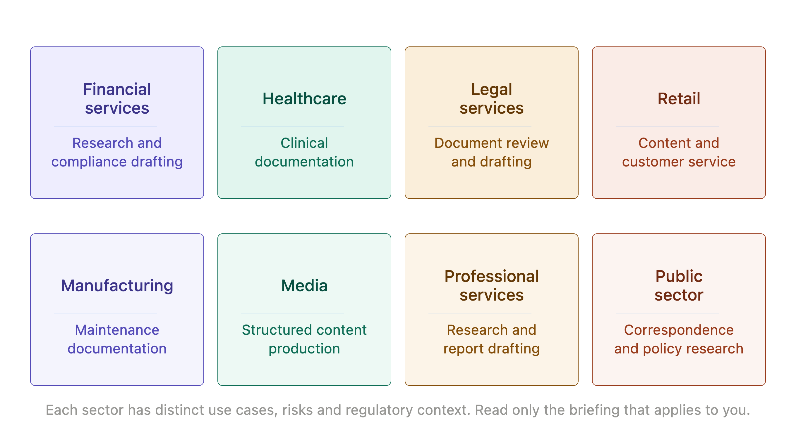
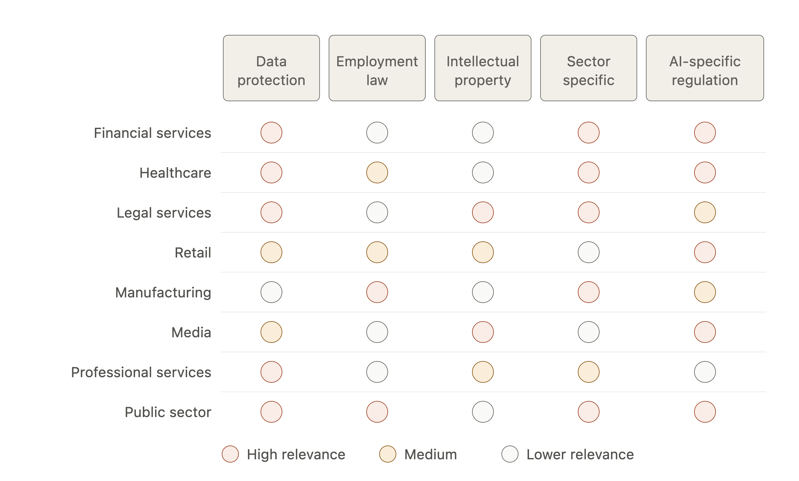
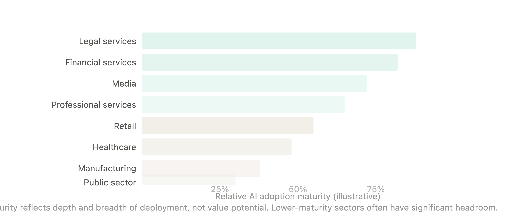

# Chapter 7: Sector Briefings

AI adoption does not look the same across industries. The use cases that generate most value in financial services are different from those in healthcare. The regulatory constraints facing a law firm are different from those facing a retailer. The risks that matter most in manufacturing are different from those in media.

This chapter provides eight self-contained briefings, one for each of the sectors where AI adoption is most active. Each briefing covers the same ground: the highest-value use cases, the risks specific to that sector and the regulatory context a manager needs to be aware of. The briefings are designed to be read independently - a manager in healthcare does not need to read the financial services section and vice versa.

One caveat applies to all eight. AI capabilities and the regulatory environment are both moving quickly. The briefings reflect the landscape as of mid-2026. The broad patterns are durable; specific regulatory details should be verified against current guidance before being relied upon.

*Figure 7-1. Sector Map.*

## Financial Services

**Where AI creates most value**

Financial services organizations have found genuine productivity gains in three areas. The first is research and analysis: AI handles the initial synthesis of large volumes of market data, analyst reports and regulatory filings, freeing investment professionals for interpretation and judgment. The second is customer communications: AI drafts responses to routine queries, flags complex cases for human handling and maintains consistency across high-volume client correspondence. The third is compliance documentation: AI generates first drafts of regulatory reports, compliance submissions and policy documents, significantly reducing the time senior compliance staff spend on drafting.

**The risks that matter most**

The confidence problem is acute in financial services. An AI-generated market analysis that contains a plausible but incorrect figure can feed a decision with real financial consequences. Verification workflows are not optional - they are the price of using AI in any context where a number will be acted upon.

Data leakage is a particular concern because of the sensitivity of client financial data and the volume of material non-public information that financial services organizations routinely handle. The data classification questions discussed in Chapter 4 apply with additional force here.

**The regulatory context**

Financial services is one of the most heavily regulated AI environments. Regulators in most jurisdictions have issued guidance on AI use in financial services, with particular attention to model risk management, explainability and bias in credit and insurance decisions. The use of AI in advice-giving contexts is subject to suitability and fiduciary requirements that do not disappear because a machine generated the initial recommendation. Any AI deployment in a regulated advice context requires legal review before implementation.

> **MARGIN - Financial Services**
> *The confidence problem and data sensitivity both require active management. Verification workflows and clear data classification policies are the minimum. Anything touching advice, credit or insurance needs legal review before going live.*

## Healthcare

**Where AI creates most value**

Healthcare organizations have found AI most useful in three areas that do not directly touch clinical decisions. Administrative documentation - clinical notes, discharge summaries, referral letters - is the largest single source of productivity gain, with clinicians reporting meaningful reductions in documentation time. Patient communication - appointment reminders, pre-procedure information, follow-up instructions - is a high-volume, lower-stakes context where AI can operate with appropriate oversight. Operational analysis - bed utilization, staffing patterns, supply chain - is a third area where AI handles data synthesis that was previously done manually.

**The risks that matter most**

The stakes of error in clinical contexts are higher than in almost any other sector, which means that the non-negotiable categories from Chapter 3 apply in force. AI does not make clinical decisions. It supports the people who do. Any deployment that blurs this boundary - that presents AI output as clinical guidance rather than a tool for clinicians - is a governance failure, not just a risk.

Patient data is protected by stringent privacy regulation in most jurisdictions and the regulatory requirements for handling health data are more demanding than those for most other data categories. The data leakage risk discussed in Chapter 4 applies with particular severity.

**The regulatory context**

Healthcare AI operates in a complex regulatory environment that varies considerably by jurisdiction and by the nature of the AI application. Software that constitutes a medical device is subject to device regulation in most jurisdictions; the boundary between administrative AI and clinical AI is not always obvious and requires careful legal assessment. Patient data regulation - HIPAA in the US, the Data Protection Act and NHS-specific guidance in the UK and equivalent frameworks elsewhere - applies to any AI system that processes patient information.

> **MARGIN - Healthcare**
> *AI supports clinicians; it does not replace clinical judgment. Administrative and operational applications are the lowest-risk starting points. Any application that touches clinical decision-making requires careful regulatory assessment before deployment.*

## Legal Services

**Where AI creates most value**

Legal AI adoption has been faster and deeper than many observers expected. Document review - reading and summarizing large volumes of contracts, correspondence and evidence - was the first area where AI produced clear value and the gains are substantial. Contract drafting has followed: AI produces first drafts of standard agreements, non-disclosure agreements and routine commercial documents at a fraction of the time previously required. Legal research - synthesizing case law, statute and commentary - is a third area where AI can accelerate work that was previously time-intensive.

**The risks that matter most**

The hallucination problem is particularly dangerous in legal contexts. A legal brief that cites a case that does not exist is not just unhelpful - it exposes the lawyer and the firm to professional sanctions. Several high-profile examples of AI-generated legal documents containing fictitious citations have made this risk visible and real. Verification of every legal reference against a primary source is not optional in legal AI use - it is the basic minimum.

Client confidentiality creates data handling constraints that go beyond standard data protection requirements. The professional obligation of confidentiality may be compromised by inputting client matter information into external AI systems, depending on the system's data handling practices. This requires careful assessment at the firm level before any external AI tool is used for client work.

**The regulatory context**

Legal AI is subject to professional regulation as well as data protection law. Bar associations and law societies in most jurisdictions are actively developing guidance on AI use in legal practice, with particular attention to supervision obligations, confidentiality and the duty of competence. The regulatory environment is developing rapidly and current guidance from the relevant professional body should be checked before implementing AI in any client-facing context.

> **MARGIN - Legal Services**
> *Verify every legal reference. No exceptions. Treat client matter data as confidential even when using AI tools with strong data commitments. Check current professional guidance from your bar association or law society before deploying AI in client work.*

## Retail and Consumer

**Where AI creates most value**

Retail has found AI most useful in three areas: personalization, operations and customer service. Product description generation - producing accurate, engaging descriptions for large catalogs - is a high-volume, relatively low-risk application where AI delivers clear productivity gains. Customer service: AI handles routine inquiries, order tracking questions and returns processing at scale, with human escalation for complex cases. Demand forecasting synthesis: AI assists in analyzing sales data patterns and generating first-pass forecast analyses for merchandising teams.

**The risks that matter most**

Customer-facing AI content carries reputational risk that internal applications do not. A product description that is inaccurate, a customer service response that is inappropriate or a promotional communication that contains a factual error reaches customers directly. The supervision levels discussed in Chapter 3 apply to customer-facing output regardless of how confident the intern appears.

Personalization at scale raises regulatory questions in jurisdictions with strong consumer protection frameworks, particularly where personalization involves pricing or where AI-driven recommendations could exploit vulnerabilities. These questions are worth examining before personalization initiatives scale.

**The regulatory context**

Retail AI intersects with consumer protection law, advertising standards and, increasingly, AI-specific regulation. The EU AI Act classifies certain retail AI applications - particularly those involving manipulation or subliminal techniques - as prohibited or high-risk, depending on their nature. Personalization that affects pricing is subject to price transparency requirements in many jurisdictions. Customer data used in AI applications is subject to data protection law.

> **MARGIN - Retail**
> *Customer-facing content needs human review before publication - the reputational stakes of a mistake are proportional to how many customers see it. Personalization initiatives that touch pricing should be reviewed for regulatory compliance before scaling.*

*Figure 7-2. Regulatory Watchlist.*

## Manufacturing

**Where AI creates most value**

Manufacturing AI adoption has concentrated in three areas. Maintenance documentation: AI generates and maintains technical documentation, work instructions and maintenance procedures, reducing the time engineers spend on documentation and improving consistency. Quality analysis: AI assists in analyzing quality data, identifying patterns in defect rates and generating reports for quality management teams. Supply chain intelligence: AI synthesizes supplier data, lead time information and inventory patterns to support procurement decision-making.

**The risks that matter most**

Manufacturing involves physical processes where errors can have safety consequences. AI-generated work instructions or maintenance procedures that contain errors are not just productivity problems - they can contribute to accidents. The verification requirements for any AI output that will be followed in a physical process are correspondingly higher than for purely administrative applications.

Integration with operational technology systems - production control, SCADA, industrial IoT - raises cybersecurity and reliability requirements that go beyond standard IT risk management. AI systems that interact with operational technology require specialist risk assessment.

**The regulatory context**

Manufacturing AI intersects with health and safety regulation, product liability law and, in regulated industries (pharmaceuticals, aerospace, food production), sector-specific quality and documentation requirements. The documentation requirements for AI-assisted processes in regulated manufacturing are particularly demanding - regulatory bodies expect evidence that human oversight was maintained at appropriate points, regardless of how much AI was involved.

> **MARGIN - Manufacturing**
> *AI-generated work instructions and maintenance procedures require higher verification standards than administrative output - they can affect physical safety. Anything touching operational technology needs specialist risk assessment.*

## Media and Communications

**Where AI creates most value**

Media organizations have adopted AI extensively in content production, with results that range from genuinely transformative to problematic. The areas of clearest value are: first-draft generation for structured content (earnings reports, sports results, weather summaries) where the output follows a predictable template and factual accuracy can be verified quickly; research and background synthesis for journalists and content teams; and translation and localization of content across languages and markets.

**The risks that matter most**

Accuracy is the core value of journalism and the core risk of AI adoption in media. An AI system that produces confident, well-written content that is factually wrong undermines the organization's fundamental asset. The verification requirements for any factual claim in AI-assisted content are not lower than for human-written content - they are the same, because the reputational consequences of publishing inaccurate content are the same regardless of how it was produced.

Intellectual property questions are particularly active in media. The training data for most large language models includes published content, raising questions about copyright and originality that are being actively litigated in multiple jurisdictions. The legal landscape around AI-generated content and copyright is genuinely unsettled and media organizations should seek current legal advice.

**The regulatory context**

Media AI intersects with copyright law, advertising standards, defamation law and, increasingly, AI transparency requirements. Several jurisdictions require disclosure when AI is used to generate content in certain contexts. The EU AI Act's provisions on AI-generated content and the obligations around synthetic media (deepfakes) apply to media organizations operating in European markets.

> **MARGIN - Media**
> *Accuracy standards for AI-assisted content are the same as for human-written content. Intellectual property questions around AI-generated content are unsettled - seek current legal advice before publishing AI-generated content at scale.*

## Professional Services

**Where AI creates most value**

Professional services firms - consulting, accounting, architecture, engineering - have found AI most productive in knowledge work that involves synthesizing large amounts of information into structured output. Research synthesis: AI reviews and summarizes relevant literature, case studies, precedents and data to support consulting and advisory work. Report drafting: AI produces first drafts of client deliverables - strategy documents, audit reports, feasibility studies - from structured inputs. Proposal development: AI generates first drafts of new business proposals, adapting standard frameworks to specific client contexts.

**The risks that matter most**

Client confidentiality and data sensitivity apply in professional services as they do in legal services. The professional obligation to maintain client confidence may be affected by the use of external AI tools for client work and the data classification questions discussed in Chapter 4 apply with force.

The quality of professional services output is the primary commercial differentiator and AI-generated content that is generic, inaccurate or poorly calibrated to a client's specific context can damage client relationships and firm reputation. The checking and refinement process for AI-assisted client deliverables needs to be proportionate to the stakes.

**The regulatory context**

Professional services AI is subject to the regulatory frameworks of the specific profession - accounting standards bodies, engineering institutes, architectural professional bodies - as well as general data protection law. Audit in particular is subject to specific regulatory requirements around the use of technology in the audit process and AI use in audit contexts requires careful assessment against current regulatory guidance.

> **MARGIN - Professional Services**
> *Client data requires the same confidentiality protections whether or not AI is involved in the work. AI-generated client deliverables need checking calibrated to the stakes - a board-level strategy document has different requirements from an internal briefing note.*

## Public Sector

**Where AI creates most value**

Public sector AI adoption has been more cautious than in the private sector, reflecting the specific accountability obligations of government and public bodies. The areas where AI is being deployed most actively are: correspondence management - drafting responses to public inquiries and ministerial correspondence; policy research - synthesizing research, evidence and stakeholder feedback to support policy development; and internal knowledge management - making existing policy documents, guidance and precedents more accessible to staff.

**The risks that matter most**

Public sector AI carries accountability obligations that private sector organizations do not face in the same form. Decisions made by or with the assistance of AI in a public sector context are subject to public law principles - fairness, rationality, consistency, the right to reasons - that require the decision-making process to be explicable and defensible. AI that generates a recommendation but cannot explain its basis is not compatible with public law obligations in most jurisdictions.

The use of AI in decisions that affect individuals - benefit entitlements, planning applications, licensing decisions - is subject to particularly stringent requirements, including in many jurisdictions an obligation to provide human review on request.

**The regulatory context**

Public sector AI is subject to general data protection law, human rights obligations, public law principles and, in many jurisdictions, specific AI governance frameworks developed for government use. The UK government's AI governance framework, the US executive orders on AI in government and the EU AI Act's specific provisions for AI in public administration all apply depending on jurisdiction. Most public sector organizations are also subject to freedom of information obligations that may affect how AI-assisted decision-making is documented.

> **MARGIN - Public Sector**
> *AI-assisted decisions must be explicable and defensible against public law principles. Any application that affects individuals' rights or entitlements requires human review capability. Check current government AI governance guidance for your jurisdiction.*

*Figure 7-3. Adoption Maturity.*

## Chapter Summary

- AI adoption looks different across sectors. Use cases, risks and regulatory contexts vary significantly and require sector-specific thinking.
- Financial services: strong gains in research, communications and compliance; acute data sensitivity and heavy regulatory oversight.
- Healthcare: administrative and operational applications are lowest-risk; clinical applications require careful regulatory assessment.
- Legal services: document review and drafting deliver clear value; verify every legal reference and treat client data as strictly confidential.
- Retail: customer-facing content needs human review; personalization initiatives touching pricing require regulatory assessment.
- Manufacturing: verification standards for AI output that affects physical processes are higher; operational technology integration needs specialist assessment.
- Media: accuracy standards are unchanged from human-written content; intellectual property questions are unsettled.
- Professional services: client confidentiality applies regardless of AI involvement; checking standards should be proportionate to stakes.
- Public sector: AI-assisted decisions must be explicable and defensible; individual-affecting decisions require human review capability.

*Next: Chapter 8 - The Roadmap: From Pilot to Production*
