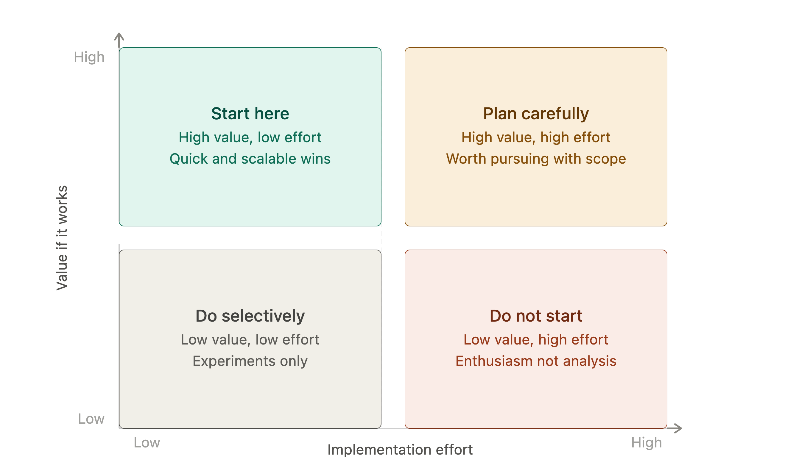
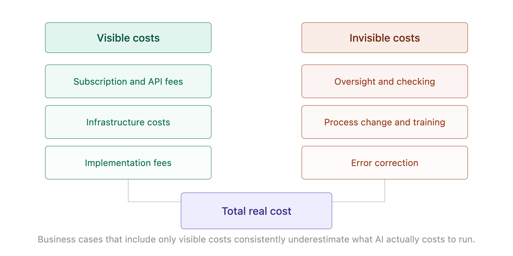
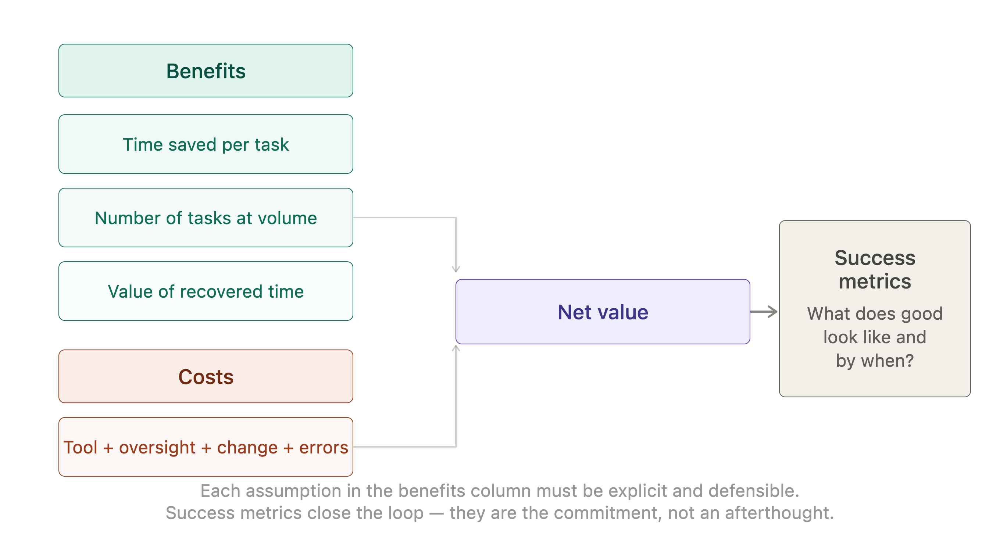

# Chapter 6: The First Week

The most common mistake organizations make when adopting AI is starting with the wrong question. The question they ask is: what can AI do? The question they should ask is: what do we spend time on that AI could handle and what would we do with the time we got back?

These are different questions. The first leads to experiments. The second leads to results.

This chapter is about finding the results quickly, without the expensive detour through experiments that consume budget, generate enthusiasm and produce nothing durable. The "first week" in the title is a mindset rather than a timeline. It means the period before your organization has developed habits, assumptions or sunk costs around AI - the window when clear thinking is easiest and the cost of changing direction is lowest. That window closes quickly. Use it well.

## The Quick Win Trap

There is a category of AI adoption that looks like success but is not. A team tries AI for drafting emails and finds it saves fifteen minutes a day. They report this upward. The initiative is declared a success. Budget is allocated. A center of excellence is formed. Eighteen months later, the organization has spent considerably more than the value of those fifteen-minute savings and the underlying work has not changed in any meaningful way.

This is the quick win trap: a genuine but modest improvement, elevated into a justification for investment that the improvement cannot support. It happens because the quick win is easy to measure, easy to communicate and emotionally satisfying - and because the harder question of where AI actually transforms something has not been asked.

The antidote is not to ignore quick wins. Some quick wins are genuinely valuable and a good place to start. The antidote is to distinguish between quick wins that are also scalable wins and quick wins that are only quick wins.

A scalable win has three properties. It applies to a large enough volume of work to produce meaningful aggregate savings. It improves in value as it is refined - the second month is better than the first because the team has learned how to brief the intern effectively. And it addresses a task that was genuinely constraining the team before - freeing time that was previously unavailable for higher-value work rather than simply making an existing task slightly faster.

> **MARGIN - Quick Win or Scalable Win?**
> *Before calling something a success, ask: does this apply at volume, does it improve with use and does it free time that was genuinely constrained? A quick win that fails all three is a demonstration, not a result.*

## Finding the Right Starting Points

The right starting points for AI adoption share a common profile. They are tasks that are high in volume, low in irreversibility and currently handled by people whose time is more valuable than the task deserves.

High volume matters because AI's economics are different from human labor economics. A person who is ten percent faster at a task saves ten percent of the time they spend on it. An AI system that handles a task reliably at scale saves all of the time previously spent on it, for every instance. The leverage is in volume.

Low irreversibility matters because starting points are learning opportunities. The first wave of AI adoption will produce errors. The question is whether those errors are catchable and correctable before they cause harm. Tasks where the output goes through human review before acting on anything are safe learning environments. Tasks where the output acts directly on something consequential are not.

The people mismatch matters because time is the scarce resource the organization is trying to recover. Automating a task that was costing ten hours a week of a junior administrator's time produces modest value. Automating the same task that was costing ten hours a week of a senior professional's time produces considerably more - because the recovered time is worth more and because the senior professional will put that time to better use.

> **MARGIN - The Profile**
> *High volume, low irreversibility, done by people whose time is too valuable for it. If a task fits all three, it is a genuine starting point. If it fits one or two, it may still be worth doing - but manage expectations accordingly.*

## The Quick Win Filter

Before committing resources to any AI initiative, run it through a simple filter. The filter has two dimensions: the value of getting it right and the effort required to implement it responsibly.

High value, low effort: start here. These are the initiatives that produce results quickly without large investment in process change or infrastructure. Drafting routine documents, summarizing reports, generating first-pass analysis of structured data - tasks where the output is easily reviewed and the volume is high.

High value, high effort: plan carefully. These initiatives are worth pursuing but need proper scoping, clear governance and realistic timelines. Replacing a significant manual process, building AI into a customer-facing workflow or integrating AI with proprietary data sources belong here.

Low value, low effort: do selectively. These are the experiments - low stakes, low cost, potentially useful for building capability and confidence even if the direct value is modest. Useful in small doses, dangerous in large ones.

Low value, high effort: do not start. These are the initiatives that emerge from enthusiasm rather than analysis. They consume budget and attention without producing proportionate value and they crowd out the high-value work.

*Figure 6-1. Quick Win Filter.*

> **MARGIN - Filter First**
> *Apply the filter before the pilot. A pilot that was always going to be low value and high effort is not a learning opportunity - it is an expensive way to confirm something that clear thinking would have revealed in advance.*

## The Real Cost of an AI Initiative

The business case for an AI initiative almost always underestimates cost. This is not dishonesty - it is the result of making the visible costs the basis for the calculation while leaving the invisible costs out of the model.

The visible costs are straightforward: the subscription or API fees for the AI tools, any infrastructure required to support them and any direct professional fees for implementation. These are real costs and they belong in the model.

The invisible costs are where business cases typically fall short. The first is oversight: someone needs to check the outputs, manage the exceptions and handle the cases where the intern produces something that needs correction. This is not a one-time cost - it is an ongoing operational cost that scales with usage. Organizations that plan for the tool cost but not the oversight cost consistently find that their actual cost of operation is higher than projected.

The second invisible cost is process change. Introducing AI into an existing workflow almost always requires changing the workflow. People need to learn new habits, new checkpoints need to be introduced and old processes need to be retired. This takes time - more time than it appears to - and the productivity dip during transition is real.

The third invisible cost is error correction. Some proportion of AI outputs will be wrong and correcting them takes time. In a well-designed workflow this proportion is small and the correction is fast. In a poorly designed one it is neither. The error correction cost is genuinely difficult to estimate in advance, but ignoring it is a mistake.

*Figure 6-2. Real Cost Model.*

> **MARGIN - Model the Full Cost**
> *Tool fees plus oversight plus process change plus error correction. That is the full cost model. A business case that only includes tool fees is not a business case - it is an optimistic estimate masquerading as one.*

## Building a Business Case That Will Survive Scrutiny

A business case for an AI initiative that survives scrutiny has four components: a clear statement of the problem being solved, a realistic estimate of costs including the invisible ones, a credible estimate of benefits including the assumptions behind them and a set of success metrics that will allow the organization to know whether the initiative has delivered what was promised.

The problem statement matters more than it appears to. The clearest sign that a business case will not survive scrutiny is a problem statement that begins with "AI can now..." rather than "we currently spend..." The first is a technology looking for a problem. The second is a problem looking for a solution. Boards and CFOs are experienced at telling the difference.

The cost estimate has been covered above. What matters on the benefit side is being explicit about the assumptions. How much time will be saved per task? How many tasks does that apply to? What will the recovered time be used for? What is the value of that use? Each of these is an assumption that can be challenged. Having explicit, defensible answers to each challenge is what separates a credible business case from one that does not hold up in the room.

The success metrics close the loop. They allow the organization to know, at a defined point in the future, whether the initiative delivered what was promised - and to make an informed decision about whether to continue, expand or stop. A business case without success metrics is a commitment without accountability.

*Figure 6-3. Intern ROI Calculation.*

> **MARGIN - The Survivor Test**
> *Read the business case as a skeptical CFO would. Is the problem real and specific? Are the costs complete? Are the benefit assumptions explicit and defensible? Are there success metrics with a date? If the answer to any of these is no, the case is not ready.*

## Starting Small and Learning Fast

The right approach to the first wave of AI adoption is a portfolio of small, focused initiatives rather than a single large transformation. Small initiatives are faster to start, easier to evaluate and cheaper to stop if they do not deliver. They also produce learning - about how the intern performs on specific task types in your organization's specific context - that cannot be obtained any other way.

The portfolio should be deliberately diverse. Different task types, different parts of the organization, different levels of output stakes. The goal is not to find the one AI use case that transforms everything - it is to build a map of where AI creates genuine value in your specific context and where it does not.

That map is the most valuable output of the first wave. It tells you what to expand, what to refine and what to stop. It also tells you something about your organization's readiness - its capacity for oversight, its ability to change processes and its appetite for the kind of disciplined management that AI requires to deliver its potential.

> **MARGIN - Build the Map**
> *The goal of the first wave is not transformation. It is a map of where AI creates genuine value in your context. That map, built through small focused initiatives and honest evaluation, is worth more than any single large initiative that has not been tested.*

## Chapter Summary

- The right question is not what AI can do but what the organization spends time on that AI could handle and what the recovered time would be used for.
- Distinguish scalable wins from quick wins: scalable wins apply at volume, improve with use and free genuinely constrained time.
- The right starting points are high-volume, low-irreversibility tasks currently handled by people whose time is worth more than the task deserves.
- Filter initiatives by value and effort before piloting. Low value and high effort is not a learning opportunity - it is an expensive confirmation of something clear thinking would have revealed.
- The real cost of an AI initiative includes tool fees, oversight, process change and error correction. A business case that omits the invisible costs is not credible.
- A business case that survives scrutiny has a specific problem statement, complete costs, explicit benefit assumptions and defined success metrics.
- The goal of the first wave is a map of where AI creates genuine value in your context, not a single transformative initiative.

*Next: Chapter 7 - Sector Briefings: AI Across Industries*
