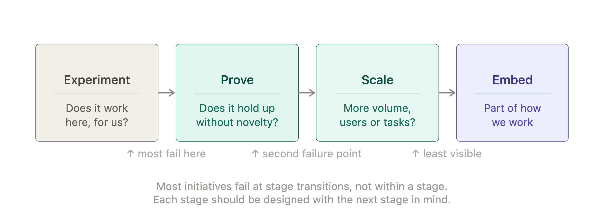
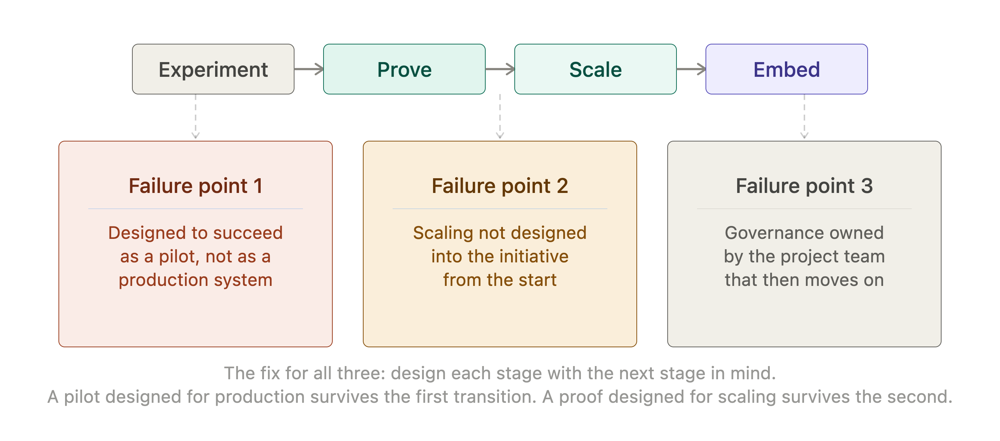
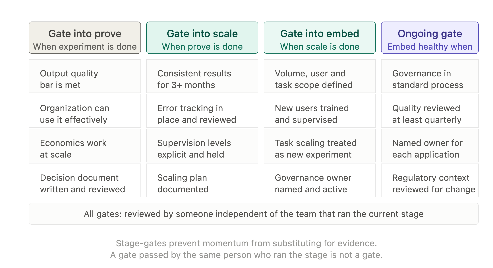

# Chapter 8: The Roadmap

Most AI initiatives start well. A pilot is run, results are promising, enthusiasm is high. Then something happens. The pilot does not become a production system. The production system does not scale. The scaling effort consumes more resources than anticipated and delivers less value than projected. Eighteen months after a confident announcement, the organization is roughly where it started, with a smaller budget and more skepticism.

This failure pattern is common enough to have a name in some organizations: the pilot trap. It is not caused by bad technology or bad people. It is caused by the absence of a roadmap — a clear model of what the journey from initial experiment to embedded capability looks like and what decisions are required at each stage.

This chapter provides that roadmap. Four stages, each with a different focus and a different set of decisions. Understanding where you are and what the next stage requires is the most reliable way to avoid the trap.

*Figure 8-1. Adoption Stages.*

## Stage 1: Experiment

The experiment stage is the shortest and in some ways the easiest. A small team, a specific task type, a defined time period. The goal is not to prove that AI works in general — it is to find out whether AI works for this task, in this organization, with the people and processes currently in place.

The experiment stage has three outputs, not one. The first is evidence about the task: does AI produce useful output on this type of work, at the quality level required, with the brief investment the team can make? The second is evidence about the organization: can the team use the tool effectively, does the workflow accommodate AI output, are the oversight processes manageable? The third is evidence about the economics: what does the tool actually cost to run, including oversight time and what productivity is being recovered?

Most organizations treat only the first output as the measure of success. This is how pilots get declared successful on the basis of output quality alone, while the organizational and economic evidence is ignored or deferred. When the initiative scales, the organizational friction and economic costs that were not examined in the pilot stage emerge and derail the project.

A well-run experiment answers all three questions deliberately. It ends with a decision document — a brief, honest summary of what was learned — rather than an enthusiastic presentation of the best outputs the tool produced.

> **MARGIN — Three Questions, Not One**
> *A successful experiment answers: does the output meet the quality bar, can the organization use it effectively and does the economics work at scale? Answering only the first question and ignoring the other two is how enthusiastic pilots become stalled production projects.*

## Stage 2: Prove

The prove stage is where most initiatives stall. The experiment worked, the decision was made to go further and now the task is to demonstrate that the initiative can deliver reliable value at a larger scale and over a longer time period than the experiment covered.

The prove stage has a different character from the experiment stage. In an experiment, novelty is a feature — people are engaged, oversight is tight and the team is interested in the results. In the prove stage, the initiative has to work when it is no longer new. The team has moved on to other priorities. The oversight that was careful in the first week has become routine. The results need to hold up when nobody is paying special attention.

This is where the governance structures discussed in Chapters 3 and 4 become load-bearing. Supervision levels need to be set explicitly and maintained consistently. Error tracking needs to be in place so that quality drift is visible. The brief templates developed in Chapter 2 need to become part of the standard workflow rather than being reinvented each time.

The prove stage is complete when the initiative has produced consistent value over a period long enough to give confidence that the experimental results were not exceptional. For most initiatives, this means at least three months of production use with documented outcomes.

> **MARGIN — Survive the Loss of Novelty**
> *The prove stage is where the initiative has to work without the energy of a new experiment behind it. Governance structures, error tracking and standardized briefs are what hold quality up when the novelty has worn off.*

## Stage 3: Scale

Scaling an AI initiative means applying it to more volume, more users or more task types. Each of these is a different kind of scaling challenge and they should not be conflated.

Volume scaling — doing more of the same thing with the same team — is the most straightforward. If the initiative has proved itself on a hundred documents per week, scaling to a thousand requires checking that the quality holds at higher volume, that oversight processes remain manageable and that the economics still work when tool costs scale with usage.

User scaling — rolling out to more people — is a change management challenge as much as a technical one. People who were not part of the experiment have no direct experience of the tool's strengths and limitations. They need training that covers not just how to use the tool but what not to trust it with. Supervision levels need to be reset for new users, who have no track record with the tool.

Task scaling — applying the initiative to new task types — is the most dangerous form of scaling. The evidence from the prove stage applies to the original task type. A different task type is a different experiment and should be treated as one. The temptation to assume that a tool that works well on task A will work equally well on task B is responsible for a significant proportion of AI initiative failures.

> **MARGIN — Three Kinds of Scaling**
> *Volume, user and task scaling are different challenges. Volume scaling is primarily operational. User scaling is primarily change management. Task scaling is primarily a new experiment. Treat each accordingly.*

## Stage 4: Embed

An embedded AI capability is one that has become part of how the organization works — not a separate initiative with its own governance structure, but a normal part of the workflow that happens to involve AI at certain points.

The transition from scale to embed is less a stage than a shift in how the organization relates to the capability. In the scale stage, the AI initiative is still a thing the organization is doing. In the embed stage, it is a way the organization works. The distinction matters because the management effort is different. An embedded capability needs maintenance and governance, not project management.

The embed stage has two requirements. The first is that the governance structures — supervision levels, audit trails, sign-off protocols, data classification — have been absorbed into standard operating procedure rather than sitting in a separate AI governance framework. They are just how the process works. The second is that the capability is being maintained as the technology and the organization's needs evolve. An embedded capability that was set up two years ago and never reviewed is a liability — the tool may have changed, the regulatory environment may have changed and the organization's risk appetite may have changed.

> **MARGIN — Governance Becomes Process**
> *An embedded capability has governance built into the workflow, not bolted on as an AI-specific framework. If the governance requires a separate document to explain, it has not yet been embedded.*

## Where Initiatives Fail

Most AI initiatives fail at the transition between stages rather than within a stage. Understanding where the common failure points are makes them avoidable.

**Experiment to prove** is the most common failure point. The experiment produces good results in the controlled conditions of a pilot. The prove stage requires those results to hold under normal operating conditions — with less oversight, more varied input quality and the ordinary friction of organizational life. Initiatives that were designed to succeed as experiments rather than as production systems fail here.

**Prove to scale** is the second common failure point. The initiative has produced reliable value in its original context. The decision is made to scale. But scaling was not designed into the initiative from the start — the tools, processes and oversight mechanisms that work for a team of three do not simply extend to a team of thirty. The prove stage needs to include explicit design work on how scaling will work before the scaling begins.

**Scale to embed** is the third failure point and the least visible. The initiative appears to be working. Volume is high, users are trained, results look good. But the governance is still being maintained by the project team that launched the initiative and when that team moves on to other things, the governance deteriorates. The capability persists but the quality assurance that made it reliable does not.

*Figure 8-2. Failure Points.*

> **MARGIN — Design for the Next Stage**
> *Each stage should be designed with the next stage in mind. An experiment that was not designed for a production environment will not survive the transition. A proof that was not designed for scaling will not scale.*

## The Build vs Buy Decision

At some point in the roadmap, most organizations face a build versus buy decision: do we use a general-purpose AI tool from a vendor, or do we build something specific to our needs?

The decision depends on four factors. The first is differentiation: does a custom solution create competitive advantage, or is the underlying task generic? Summarizing documents is generic. Applying your organization's specific analytical framework to documents is less so. The more specific the task, the stronger the case for custom development.

The second is data: does the task require training or fine-tuning on your organization's own data, or does a general-purpose model work well enough with the right brief? Many tasks that appear to require custom development can be handled adequately by a well-briefed general-purpose model.

The third is cost: what is the total cost of custom development, including ongoing maintenance, compared to the ongoing cost of a vendor tool? Custom development costs are routinely underestimated and maintenance costs — which continue indefinitely — are routinely omitted from the comparison.

The fourth is speed: how quickly does the organization need the capability and how long would custom development take? A vendor tool that is available now and meets eighty percent of the need often delivers more value than a custom solution that meets a hundred percent of the need in eighteen months.

> **MARGIN — Eighty Percent Now**
> *A vendor tool that meets eighty percent of the need today usually delivers more value than a custom solution that meets a hundred percent of the need in eighteen months. The gap between eighty and a hundred percent narrows as you learn how to use the tool well.*

## The Stage-Gate Checklist

A stage-gate is a defined checkpoint at which the organization decides whether to proceed to the next stage, refine the current stage or stop. Stage-gates are the mechanism that prevents initiatives from drifting forward by momentum rather than by evidence.

Each stage-gate has a set of questions that must be answered satisfactorily before the initiative proceeds. The questions are not a bureaucratic hurdle — they are the evidence of learning that justifies the next investment.

*Figure 8-3. Stage-Gate Checklist.*

The stage-gate checklist should be completed by someone who was not responsible for running the current stage. Self-assessment of a stage you ran is not reliable — the person who managed the pilot is invested in its success and will tend to interpret ambiguous evidence optimistically. A brief external review — even by a colleague from another part of the organization — produces a more honest assessment.

> **MARGIN — Independent Review**
> *Stage-gate assessment should not be done by the person who ran the stage. Investment in a stage's success makes objective assessment difficult. A brief review by someone independent, even a colleague, produces a more honest picture.*

## Chapter Summary

- Most AI initiatives fail at stage transitions rather than within a stage. The roadmap makes the transitions explicit and manageable.
- Stage 1 (Experiment): answer three questions — does the output meet the quality bar, can the organization use it effectively and does the economics work at scale?
- Stage 2 (Prove): demonstrate consistent value over time without the energy of novelty. Governance structures become load-bearing at this stage.
- Stage 3 (Scale): volume, user and task scaling are different challenges requiring different approaches. Task scaling is a new experiment.
- Stage 4 (Embed): governance moves from a separate framework into standard operating procedure. The capability requires maintenance not project management.
- The build vs buy decision depends on differentiation, data requirements, total cost and speed. Vendor tools that meet eighty percent of the need now often outperform custom solutions that meet a hundred percent later.
- Stage-gates prevent momentum from substituting for evidence. Independent review at each gate improves assessment quality.

*Next: Chapter 9 — Redesigning Work: Augmentation in Practice*
