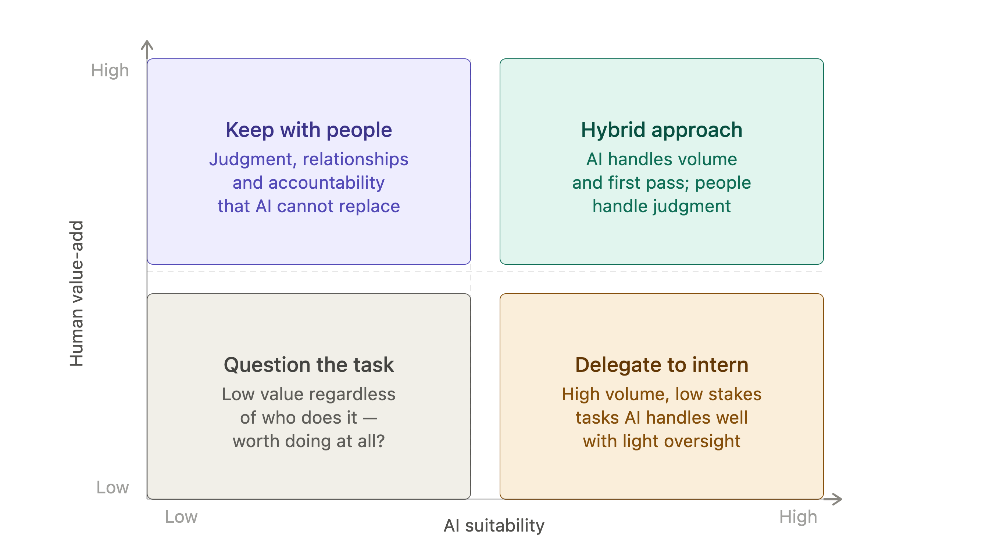
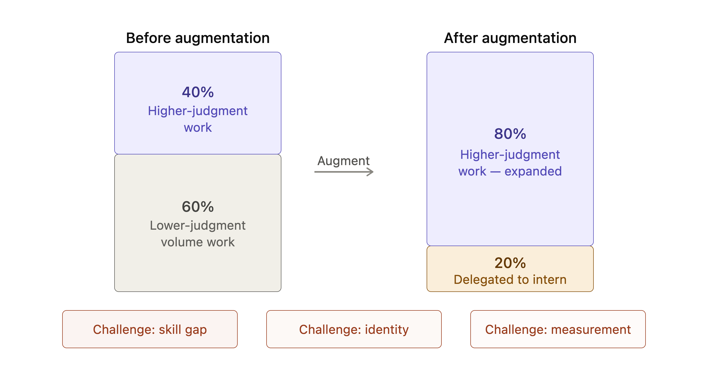
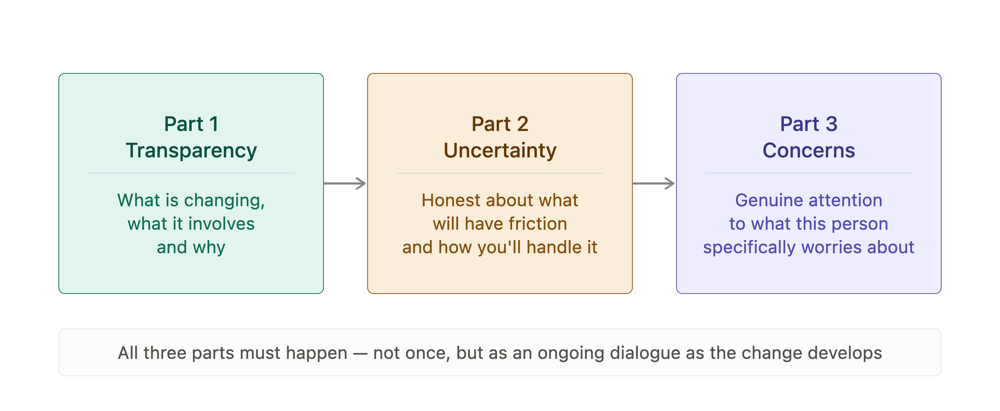

# Chapter 9: Redesigning Work

Augmentation is a word that has been used so often in discussions of AI that it has started to lose its meaning. It has become a reassurance — a way of saying that AI will help rather than replace — without specifying what help actually looks like in practice or what changes when a capable AI system joins the workflow.

This chapter is about the practical reality of augmentation: what changes, what stays the same, how to design the change deliberately rather than letting it happen by default and how to have the conversations with your team that the change requires.

The central argument is simple. Augmentation does not mean adding AI to existing work. It means redesigning work around what AI can do well and what people do well, so that the combination produces better results than either could alone. Organizations that add AI without redesigning work get modest gains. Organizations that redesign work around AI get something more substantial.

## What Augmentation Actually Means

The easiest way to understand augmentation is to contrast it with two alternatives that look similar but are not.

The first alternative is automation: AI replaces a task entirely, with no human involvement in the output. Automation is appropriate for well-defined, high-volume, low-stakes tasks where the output does not require human judgment. It is not augmentation — it is replacement of a task, which may or may not require redesigning the role that previously contained it.

The second alternative is assistance: a human does the work largely as before, with AI available as a tool that can be consulted occasionally. Assistance produces modest gains — the convenience of having the intern available — without changing the fundamental structure of how work gets done. Most organizations that have "adopted AI" are at the assistance stage.

Augmentation is the third option and the most demanding. It requires identifying which parts of a role or workflow are best handled by AI and which are best handled by people and redesigning the workflow so that each handles what it does best. This is a management task, not a technology task. The technology is available. The redesign requires judgment about work, people and organizational context that only the manager can provide.

> **MARGIN — Assistance Is Not Augmentation**
> *Adding AI as an available tool without changing how work is structured is assistance, not augmentation. Assistance produces modest gains. Augmentation requires deliberately redesigning which parts of the work go to the intern and which stay with the person.*

## The Augmentation Audit

The starting point for redesigning work is understanding the current work in enough detail to make deliberate decisions about it. The augmentation audit is a structured way of doing this.

The audit maps the tasks that make up a role or workflow against two dimensions. The first is AI suitability: how well does AI handle this type of task, given the intern's known strengths (drafting, transformation, volume consistency, explanation) and limitations (verified facts, current information, organizational context, judgment calls)? The second is human value-add: how much does human involvement add to this task, beyond what AI can provide? Tasks that score high on human value-add are tasks where experience, judgment, relationships, accountability or tacit organizational knowledge make a material difference to the outcome.

The audit produces four categories of task. Tasks that are high on AI suitability and low on human value-add are candidates for delegation to the intern with light oversight. Tasks that are low on AI suitability and high on human value-add stay with people. Tasks that score high on both require a hybrid approach — AI handles the volume and first-pass work, people handle the judgment and refinement. Tasks that score low on both are worth questioning regardless of AI.

*Figure 9-1. Augmentation Audit.*

> **MARGIN — Map Before You Delegate**
> *The augmentation audit maps every significant task in the role before deciding what to delegate. Delegating without mapping is guessing. The map takes time once. The guessing costs time continuously.*

## How Roles Change

When augmentation is done well, roles do not disappear — they shift. The parts of the role that were high volume and low judgment move to the intern. The parts that were high judgment and low volume become more central. The person in the role spends less time on the former and more on the latter.

This sounds straightforwardly positive and often it is. A analyst who previously spent sixty percent of their time gathering and formatting data and forty percent interpreting it can, with well-designed augmentation, spend twenty percent on data handling and eighty percent on interpretation. The role has more of what made it interesting and less of what made it tedious.

But the shift creates real challenges that managers need to anticipate. The first is skill gap: if the high-judgment tasks now take up more of the day, the person needs to be able to do them well. If their capability was calibrated to spending sixty percent of their time on lower-skill work, the shift may expose gaps that were not previously visible. The role has been upgraded and the person may or may not be ready for the upgrade.

The second challenge is identity. People often have strong attachments to the parts of their work that are being delegated to AI — not because those parts were the most intellectually demanding, but because they were familiar, because they created a sense of productivity, or because they were how the person learned the role in the first place. Telling someone that AI will now do the part of their job they have done for ten years requires careful handling regardless of how positive the intended outcome is.

The third challenge is measurement. If a role's output was previously measured by volume — documents processed, calls handled, reports produced — and augmentation means the person now handles far fewer but higher-value tasks, the old metrics no longer reflect the contribution. Managers who redesign roles without redesigning how those roles are measured create people who are doing better work but appearing to do less.

*Figure 9-2. Role Redesign Model.*

> **MARGIN — Redesign the Metrics Too**
> *When the work changes, the way you measure it needs to change with it. A person handling fewer but higher-value tasks under augmentation should not be measured by the volume metrics designed for the pre-augmentation role.*

## The Change Conversation

The most important management skill in augmentation is not understanding the technology. It is having an honest conversation with the people whose work is changing.

The conversation has three parts and all three need to happen — not once, but as an ongoing dialogue as the change develops.

The first part is transparency about what is changing and why. People deserve to know that their role is being redesigned, what the redesign involves and what the rationale is. Vague reassurances that "AI will just help" while the work quietly changes around someone are a failure of management, not a kindness. The person finds out eventually. Finding out through transparency builds trust. Finding out through experience erodes it.

The second part is honest acknowledgment of what is uncertain. Not every redesign goes smoothly. Not every skill gap is filled quickly. Not every measurement system is updated in time. Acknowledging that the transition will have friction — and that you will work through it together — is more credible than promising a seamless transformation.

The third part is genuine attention to the person's concerns. The concerns will vary: some people will worry about job security, some about their ability to perform in a changed role, some about the loss of work they valued. None of these concerns should be dismissed. Each deserves a real response, which may mean a real commitment to training, to adjusted timelines or to revised expectations.

*Figure 9-3. Change Conversation Framework.*

> **MARGIN — Three Parts, Not One**
> *The change conversation has three parts: transparency about what is changing and why, honest acknowledgment of uncertainty and genuine attention to the person's specific concerns. Skipping any one of the three produces a conversation that feels complete but leaves the person unsatisfied.*

## Designing for Skill Development

Augmentation changes what skills are most valuable in a role. It does not eliminate the need for skill development — it redirects it.

The skills that become more valuable under augmentation are broadly the skills that AI cannot replicate: judgment, interpretation, relationship management, accountability, creativity in ambiguous situations and the organizational knowledge that comes from experience. These are the skills that the redesigned role increasingly depends on.

The skills that become less central are those the intern handles well: drafting, reformatting, summarizing, searching and volume consistency. These skills do not become worthless — the ability to evaluate AI output depends partly on being able to do the underlying task — but they are no longer the primary focus of development.

This has implications for how organizations design learning and development programs. A program built around the skills that AI now handles is a program that is training people for the pre-augmentation version of the role. The more useful investment is in the skills that the augmented role depends on most heavily — and in the meta-skill of working effectively with AI, which includes knowing how to brief it, how to evaluate its output and how to maintain the judgment that makes evaluation reliable.

> **MARGIN — Train for the Augmented Role**
> *Learning and development programs should reflect the skills the augmented role requires, not the skills the pre-augmentation role required. Training people to do what the intern now does is preparing them for a role that no longer exists in its original form.*

## Chapter Summary

- Augmentation means redesigning work around what AI and people each do best. Adding AI without redesigning work produces assistance, not augmentation.
- The augmentation audit maps tasks against AI suitability and human value-add to identify what to delegate, what to keep and what requires a hybrid approach.
- When augmentation is done well, roles shift toward higher-judgment work. This creates skill gaps, identity challenges and measurement problems that managers need to anticipate.
- The change conversation has three parts: transparency about what is changing and why, honest acknowledgment of uncertainty and genuine attention to the person's specific concerns.
- Augmentation changes what skills are most valuable. Learning and development programs should reflect the skills the augmented role requires, not the pre-augmentation role.

*Next: Chapter 10 — The Intelligent Enterprise: Leading When AI is Everywhere*
