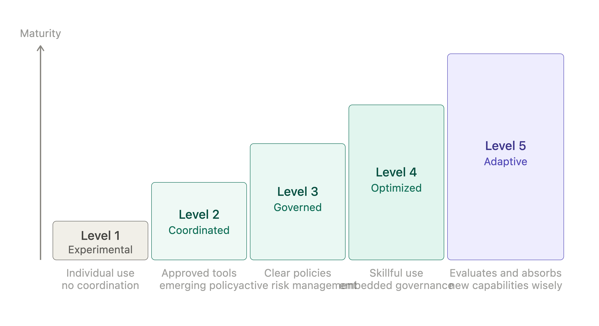
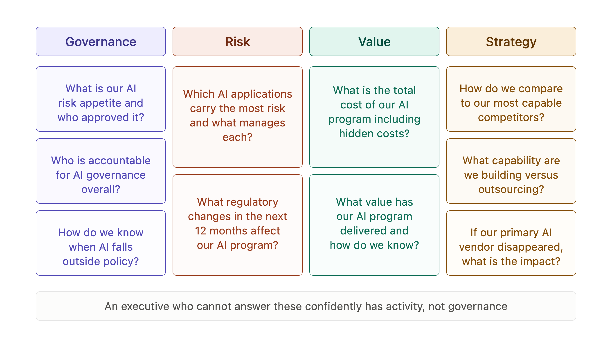
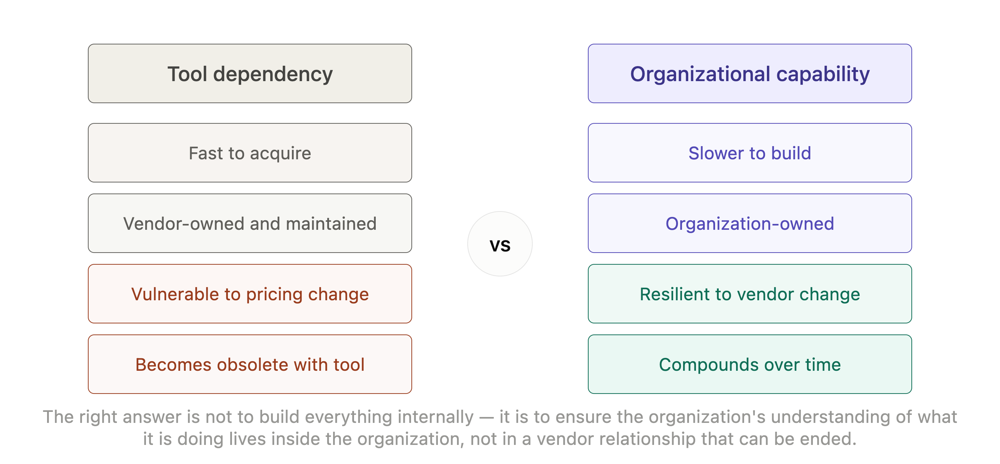

# Chapter 10: The Intelligent Enterprise

There is a difference between an organization that uses AI and an organization that has learned to use AI well. The first has tools. The second has capability. Tools can be switched off, replaced or rendered obsolete by the next generation of technology. Capability - the organizational knowledge of how to direct AI effectively, how to manage its risks and how to extract genuine value from it - persists and compounds.

This chapter is about what it takes to lead the second kind of organization. Not the early adopter excitement of the first experiments, nor the project management discipline of scaling a pilot - but the steady, strategic leadership required when AI is everywhere in the organization and the question is no longer whether to use it but how to keep using it well.

That is a different kind of challenge and it requires a different kind of leadership posture.

## The Leadership Shift

In the early stages of AI adoption, the leadership challenge is primarily managerial: identify good use cases, run good experiments, build appropriate governance. These are the challenges this book has addressed in the chapters that came before. They require good judgment, organizational discipline and a willingness to invest in governance that does not always feel urgent.

In the later stages - when AI is embedded across the organization, when most workflows have some AI component, when the team members who joined in the last two years have never known the organization without it - the leadership challenge shifts.

The shift has three dimensions. The first is from project to policy: the question is no longer what each initiative should do but what the organization's overall approach to AI should be and how that approach is maintained consistently as technology and regulatory environments evolve.

The second is from oversight to culture: individual supervision decisions matter less than whether the organization has developed the judgment, habits and norms that make good supervision happen naturally. An intelligent enterprise does not rely on managers checking every output - it relies on people who have learned what to check, why checking matters and how to recognize when something needs escalation.

The third is from adoption to adaptation: the AI landscape will continue to change and probably faster than it has so far. Leading an intelligent enterprise means building an organization that can absorb and evaluate new AI capabilities without either rushing to adopt everything or reflexively resisting change.

> **MARGIN - Project to Policy**
> *The transition from project to policy is the moment AI governance stops being a special initiative and becomes part of how the organization runs. It requires explicit management attention - it does not happen automatically when enough pilots succeed.*

## The AI Maturity Model

Most organizations are somewhere on a journey from ad hoc AI use to genuine organizational capability. Understanding where your organization is on that journey is the first step to leading it deliberately toward the next stage.

*Figure 10-1. AI Maturity Model.*

**Level 1 - Experimental**: AI is used by individuals and teams independently, without organizational coordination. Use cases are discovered opportunistically. There is no policy, no governance and no systematic evaluation of what is working. The risk at this level is that the organization has less visibility into how AI is being used than it thinks.

**Level 2 - Coordinated**: The organization has begun to coordinate AI use. There is a recognized list of approved tools, emerging policy on data handling and some cross-team learning about what works. Governance exists but is fragmented. The risk at this level is that coordination creates the appearance of control without the substance.

**Level 3 - Governed**: The organization has clear policies, supervision frameworks and accountability structures. AI use is documented, risk is actively managed and there is a process for evaluating new tools and use cases. The risk at this level is that governance becomes an end in itself - a compliance exercise rather than a genuine management tool.

**Level 4 - Optimized**: The organization has developed genuine expertise in using AI well. Briefing is skillful, oversight is calibrated, learning is systematic and governance is embedded in workflow rather than sitting alongside it. The risk at this level is complacency - the assumption that what works today will continue to work as the technology evolves.

**Level 5 - Adaptive**: The organization is genuinely capable of evaluating and absorbing new AI developments quickly and wisely. It has the internal expertise to assess new capabilities, the governance structures to deploy them safely and the culture to use them thoughtfully. This is the intelligent enterprise.

> **MARGIN - Know Your Level**
> *Honest assessment of where the organization currently sits is more useful than aspirational claims about where it wants to be. The level determines the right focus for leadership attention - governance at Level 2, optimization at Level 3, adaptability at Level 4.*

## The Ten Questions an Executive Should Be Able to Answer

Just as Chapter 5 prepared managers for board-level questions about AI, this chapter prepares executives for the questions that define genuine AI leadership. These are not the defensive questions a board asks - they are the strategic questions an executive should be asking themselves.

*Figure 10-2. Ten Executive Questions.*

1. What is our organization's AI risk appetite and who approved it?
2. Which AI applications in our organization carry the most significant risk and what is being done to manage each?
3. Who is accountable for AI governance overall and what does that accountability include in practice?
4. How do we know when AI is being used in ways that fall outside our policies?
5. What is the total cost of our AI program, including oversight, process change and error correction?
6. What value has our AI program delivered and how do we know?
7. How do our AI capabilities compare to our most capable competitors?
8. What regulatory changes in the next twelve months are most likely to affect our AI program?
9. What organizational capabilities - skills, processes, culture - are we building for the long term and which are we outsourcing to vendor tools?
10. If our primary AI vendor disappeared tomorrow, what would be the impact and how quickly could we recover?

An executive who cannot answer these questions confidently does not have governance - they have activity. The difference matters when something goes wrong, when a regulator asks, or when a competitor makes a move that requires a rapid strategic response.

> **MARGIN - Activity Is Not Governance**
> *An AI program that produces reports, runs pilots and holds governance committee meetings may or may not have genuine governance. The test is whether the executive can answer the ten questions. If not, the program has activity.*

## Building Organizational Capability

The most important strategic choice an executive makes about AI is not which tools to adopt. It is how much of the capability to build inside the organization versus how much to depend on vendors and consultants.

Tool dependency is the default. It is faster to set up, cheaper in the short term and requires less organizational investment. The organization acquires AI capability in the form of subscriptions and the capability grows as the vendor improves the tool.

Organizational capability is harder to build. It requires investment in people, in learning, in processes and in the organizational habits that make AI use effective. It takes time to develop and it does not appear on a vendor invoice.

The case for organizational capability is that it is genuinely durable. Vendors change their pricing. Tools become obsolete. Regulatory environments shift in ways that require rapid adaptation. An organization with genuine internal capability - people who know how to evaluate AI systems, how to brief them effectively, how to govern their use and how to adapt when the landscape changes - is resilient in ways that a tool-dependent organization is not.

The right answer is not to build everything internally. Vendor tools will remain the primary delivery mechanism for AI capability in most organizations. The right answer is to ensure that the organization's understanding of what it is doing - its ability to direct, evaluate and govern its AI use - resides in the organization, not in the vendor relationship.

*Figure 10-3. Capability vs Dependency.*

> **MARGIN - Own the Understanding**
> *The capability that matters is not the tool - it is the organizational understanding of how to use the tool well, evaluate its output honestly and govern its use safely. That understanding must live in the organization, not in a vendor relationship that can be ended.*

## Strategy at the Speed of AI

AI capabilities are developing faster than most organizations' strategy cycles. A three-year technology strategy written in 2023 was already partially obsolete by 2024. An organization that sets its AI strategy and then executes against it for three years will find that the strategy no longer fits the environment it was designed for.

This is not an argument against strategy. It is an argument for a different kind of strategy - one that sets clear principles and direction while building the organizational capacity to adapt quickly to changed circumstances.

The principles that hold across technological change are the ones worth setting in strategy. What is the organization's risk appetite for AI? What categories of decision will always require human judgment? What data will the organization never put into external AI systems? These principles do not become obsolete as the technology evolves.

The specific implementations - which tools, which use cases, which workflows - are better managed through shorter cycles: quarterly reviews of what is working, annual reviews of the broader program and ad hoc reviews whenever a significant new capability or regulatory development warrants one.

The organization that can think strategically about AI without being locked into a fixed implementation is the one that will navigate the next five years well.

> **MARGIN - Principles over Plans**
> *Set principles that hold across technological change: risk appetite, human judgment requirements, data policy. Manage specific implementations on shorter cycles. A three-year AI implementation plan is likely to be wrong. A clear set of principles is likely to remain useful.*

## The Manager's Enduring Role

Throughout this book, the Digital Intern metaphor has carried the argument that managing AI is, at its core, a management challenge - not a technical one. The intern is capable, tireless and well-read. They need clear instructions, appropriate supervision, honest assessment of their limitations and a manager who knows what to keep.

That description does not change as the intern gets better. A more capable intern still needs clear instructions. The instructions just become more sophisticated, the supervision more nuanced and the assessment of limitations more demanding. As AI systems become more capable - and they will - the premium on good management judgment does not decrease. It increases.

The organizations that will use AI best over the next decade are not the ones that adopt the most tools or move the fastest. They are the ones that develop the most capable management of AI - the clearest direction, the most honest evaluation, the most thoughtful governance and the most deliberate approach to building capability that endures beyond any individual tool.

That is the intelligent enterprise. And building it is, first and last, a management job.

> **MARGIN - The Intern Gets Better**
> *As AI systems become more capable, the premium on good management judgment increases rather than decreasing. A more capable intern given poor direction produces more capable poor output. The management challenge scales with the technology.*

## Chapter Summary

- The leadership challenge shifts from project management to policy, from oversight to culture and from adoption to adaptation as AI becomes embedded across the organization.
- Five levels of AI maturity run from experimental to adaptive. Honest assessment of current level determines the right focus for leadership attention.
- Ten questions define genuine AI executive leadership. An executive who cannot answer them confidently has activity, not governance.
- The most important strategic choice is how much AI capability to build inside the organization versus depending on vendors. Organizational capability is more durable; tool dependency is faster to acquire.
- AI strategy should set clear principles that hold across technological change and manage specific implementations on shorter cycles.
- As AI systems become more capable, the premium on good management judgment increases. The organizations that use AI best are those with the most capable management of it.

*Next: Conclusions - Managing the Intern Well*
