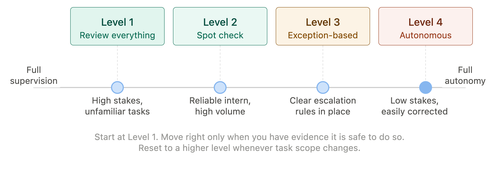
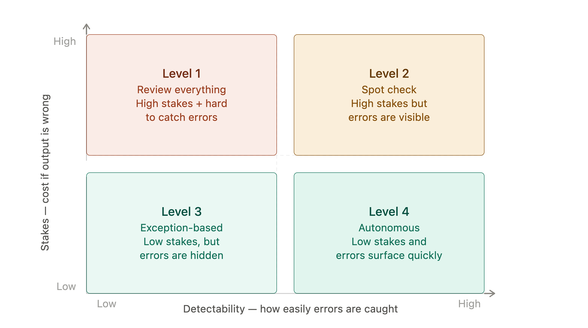
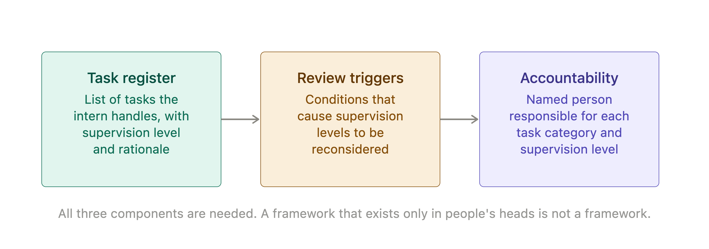

# Chapter 3: Supervising the Intern

Every manager who has hired a capable but inexperienced person has faced the same question: how much rope do you give them? Too little and you waste their potential, spend your own time doing work they could handle and signal that you do not trust them to deliver. Too much and you expose your organization to avoidable mistakes, find yourself fixing errors that should have been caught and lose the confidence of clients or colleagues who expected more control.

The same question applies to your Digital Intern, and the stakes are higher than most managers initially realize. The intern is fast, tireless and available at any hour. Left unsupervised, they can produce and act on a great deal of output in a short time. Some of that output will be excellent. Some will be subtly wrong. A small amount may be seriously problematic. The question is not whether to supervise, but how much and under what conditions.

This chapter gives you a framework for answering that question consistently.

## The Supervision Spectrum

It helps to think of supervision not as a binary choice between full control and full autonomy, but as a spectrum with several distinct positions. Most organizations, once they understand the spectrum, find that different tasks belong at different points on it.

At one end is **full supervision**: the intern produces output, a human reads and approves every piece before it acts on anything or reaches anyone. At the other end is **full autonomy**: the intern produces output and acts on it directly, with no human review. Between these extremes sit several intermediate positions, each appropriate for a different combination of task type, output stakes and intern reliability.

The right position on this spectrum is not fixed. It changes as you learn more about how your intern performs on specific types of tasks, as the stakes of particular outputs change, and as your organization builds the verification processes needed to operate safely at lower supervision levels.

> **MARGIN - The Supervision Spectrum**
> *Full supervision at one end. Full autonomy at the other. Most tasks belong somewhere in the middle and the right position depends on the stakes of getting it wrong. Start closer to full supervision. Move toward autonomy only when you have evidence it is safe to do so.*

## Four Supervision Levels

Four positions on the spectrum are worth naming precisely, because they correspond to four distinct management postures.

**Level 1: Review everything.** Every piece of output is read by a human before it is used, sent or acted upon. This is appropriate for high-stakes outputs, unfamiliar task types, the early period of working with a new AI system and any situation where an error would be costly or embarrassing. It is not efficient for high-volume, low-stakes tasks, but efficiency is not the primary concern at this level.

**Level 2: Spot check.** The intern operates with light oversight. A human reviews a sample of outputs rather than every one and checks for patterns of error rather than individual mistakes. This is appropriate for tasks the intern has demonstrated reliability on, where volume makes full review impractical and where an individual error is correctable before it causes significant harm.

**Level 3: Exception-based review.** The intern operates largely independently, flagging outputs that fall outside defined parameters for human review. The human attention goes where the intern has identified uncertainty or where the output meets pre-defined criteria for escalation. This requires clear escalation rules and some confidence in the intern's ability to recognize the edges of its own competence.

**Level 4: Autonomous operation.** The intern produces and acts on output without routine human review. This is appropriate only for low-stakes, well-defined, highly repeatable tasks where the cost of an error is low and the error is easily detected and corrected. Very few tasks that involve external-facing output or consequential decisions belong here.

*Figure 3-1. Supervision Spectrum.*

> **MARGIN - Which Level?**
> *Ask two questions for any task: what is the cost if the output is wrong and how detectable is an error before it causes harm? High cost or low detectability means a higher supervision level. Low cost and high detectability allows you to move down the spectrum.*

## What Makes a Task Safe to Delegate

Not all tasks are equal candidates for reduced supervision. Four factors determine how safely a task can be delegated to the intern with less oversight.

**Reversibility.** Can the output be corrected after the fact if it turns out to be wrong? A draft document that will be reviewed before sending is highly reversible. An automated email sent directly to a thousand customers is not. Tasks with reversible outputs can tolerate lower supervision levels.

**Verifiability.** Can a human quickly and reliably check whether the output is correct? A summary of a document can be checked against the document. A claim about a competitor's pricing requires external verification and is harder to spot-check quickly. Easily verifiable outputs are safer at lower supervision levels.

**Stakes.** What is the consequence of an error reaching its destination uncorrected? An internal draft has different stakes from a regulatory submission. A formatting task has different stakes from a decision recommendation. Higher stakes demand higher supervision regardless of the intern's track record.

**Familiarity.** How well do you know how the intern performs on this specific type of task? An intern who has produced a hundred reliable summaries of a particular document type has a track record. An intern being asked to do something new does not. Familiarity reduces but does not eliminate the need for oversight.

*Figure 3-2. Delegation Matrix.*

> **MARGIN - The Delegation Test**
> *Before reducing supervision on any task, ask: is this reversible, verifiable, low-stakes and familiar? If the answer to all four is yes, reduced supervision is reasonable. If the answer to any one is no, think carefully before stepping back.*

## The Autonomy Trap

There is a predictable pattern in how organizations adopt AI tools. In the early period, supervision is high. Over time, as the intern produces consistently good output on familiar tasks, supervision naturally relaxes. This is rational. What is less rational is the tendency for relaxed supervision to drift into absent supervision and for the scope of tasks delegated to the intern to expand without the supervision level being reset for the new task types.

The result is an organization that is applying spot-check oversight to tasks that warrant full review or no oversight at all to tasks that were never evaluated for autonomous operation. This is the autonomy trap: not a deliberate choice to operate without supervision, but a gradual slide that happens because the intern keeps producing output that looks good and nobody resets the defaults.

The defense against the autonomy trap is simple but requires discipline. Supervision levels should be set explicitly for each task type, reviewed periodically and reset to a higher level whenever the scope of the task changes. The fact that the intern has performed well on task A does not mean it will perform equally well on task B, even if A and B look similar from the outside.

> **MARGIN - Reset the Defaults**
> *When a task changes scope, treat it as a new task. The intern's track record on the old version does not transfer automatically. Supervision levels should be set deliberately, not inherited.*

## Safety and the Limits of Intern Judgment

There are categories of output where supervision is not merely good practice but a hard requirement, regardless of how reliably the intern has performed in the past.

The first is outputs that affect individuals in consequential ways. Decisions about hiring, performance assessment, credit, access to services or any outcome that affects a person's rights or opportunities require human judgment and human accountability. The intern can inform these decisions. It cannot make them.

The second is outputs that carry legal or regulatory exposure. Any output that will be used in a legal, compliance or regulatory context should be reviewed by someone with appropriate expertise before it is relied upon. The intern's fluency in legal language does not make it a lawyer and its confidence is not a substitute for professional judgment.

The third is outputs in novel or ambiguous situations. The intern performs best on tasks it has seen many variations of. Novel situations, where the right approach is genuinely uncertain, are exactly where the intern's tendency to produce confident, plausible-sounding output is most dangerous. Human judgment is most valuable precisely where the intern seems most sure.

> **MARGIN - The Non-Negotiables**
> *Decisions that affect individuals, outputs with legal or regulatory exposure and novel situations where the right answer is genuinely uncertain - these require human review regardless of supervision level. They are not candidates for delegation.*

## Building a Supervision Framework

A supervision framework does not need to be complex. What it needs to do is make supervision levels explicit, assign responsibility clearly and provide a mechanism for review.

A practical framework has three components. First, a task register: a list of the tasks your organization uses the intern for, with a supervision level assigned to each and the rationale for that level recorded. Second, a review trigger: a defined set of conditions that cause a supervision level to be reconsidered. A task moving to a new audience, a change in the regulatory environment, a cluster of errors on a previously reliable task type - any of these should trigger a review. Third, accountability: a named person responsible for each task category, who owns the supervision level and the decision to change it.

This does not require a large governance structure. For most organizations starting out with AI, a single document maintained by whoever owns the AI program is sufficient. What matters is that supervision levels are recorded rather than assumed, and revisited rather than set once and forgotten.

*Figure 3-3. Supervision Framework.*

> **MARGIN - Write It Down**
> *A supervision framework that exists only in people's heads is not a framework. Write down which tasks your intern handles, at what supervision level and who is responsible. Review it quarterly. The document is evidence that you are managing this thoughtfully - which matters when someone asks.*

## Chapter Summary

- Supervision is a spectrum, not a binary choice. Different tasks belong at different points on it.
- Four supervision levels cover most situations: review everything, spot check, exception-based review and autonomous operation.
- Four factors determine how safely a task can be delegated: reversibility, verifiability, stakes and familiarity.
- Supervision levels tend to drift downward over time without active management. Reset defaults whenever task scope changes.
- Some categories of output require human review regardless of supervision level: decisions affecting individuals, outputs with legal or regulatory exposure and novel situations.
- A practical supervision framework records task types, supervision levels, review triggers and named accountability.

*Next: Chapter 4 - What Can Go Wrong: The Seven Risks of Generative AI*
