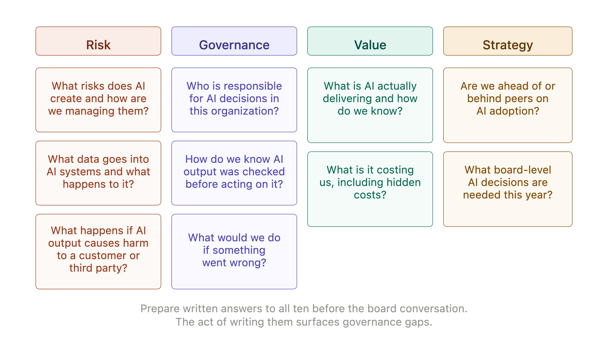
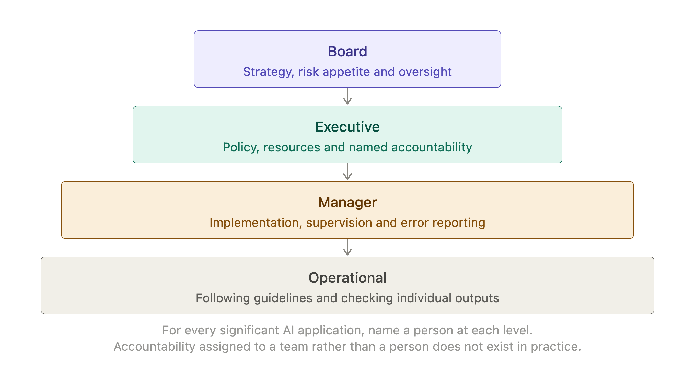
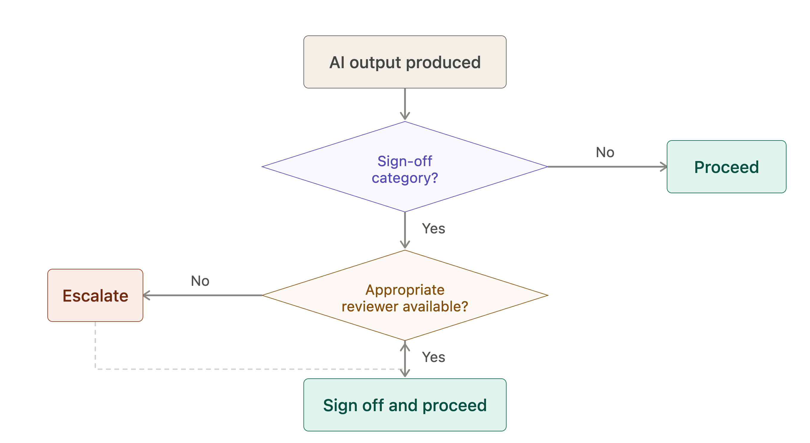

# Chapter 5: The Accountability Conversation

At some point, someone senior will ask why. Why did the AI produce that output? Who authorized it? Who checked it? What would have happened if it had been wrong? These questions arrive in different forms - a board presentation, a regulatory inquiry, an internal audit, a client complaint - but they share a common thread. They are questions about accountability and the answers need to exist before the questions are asked.

This chapter prepares you for that conversation. Not by offering defensive scripts, but by helping you build the governance structures that make the answers straightforward. An organization that has managed AI thoughtfully can answer board questions confidently, because the decisions it made are documented and the rationale behind them is clear. An organization that has not finds itself constructing answers under pressure - which is a poor position to be in.

The good news is that the accountability conversation is not technically demanding. It does not require the board to understand how large language models work. It requires them to understand how the organization is managing the risks. That is a management conversation and managers are well placed to lead it.

## Why Boards Are Asking

Boards are asking about AI for three reasons and understanding which reason is driving a particular conversation shapes how you respond.

The first is **fiduciary duty**. Directors have a legal obligation to understand material risks to the organization. AI adoption, depending on how it is used, can create material risk in areas including data protection, employment law, intellectual property and reputational exposure. A board that has not asked about these risks is not doing its job. A management team that cannot answer the questions is creating board-level anxiety.

The second is **stakeholder pressure**. Investors, regulators, customers and employees are all increasingly interested in how organizations use AI. Boards are relaying that interest inward. A question that arrives from the board may have originated with an institutional investor's ESG questionnaire, a regulator's thematic review or a customer's supplier due diligence process.

The third is **genuine uncertainty**. Many board members are personally uncertain about AI - what it can do, what it cannot do and what the right level of organizational engagement with it looks like. Questions that appear to be scrutiny are sometimes requests for help understanding a fast-moving area. The manager who can give a clear, confident, non-technical briefing on the organization's AI posture is providing real value.

> **MARGIN - Know Which Question They Are Asking**
> *A board question about AI may be fiduciary duty, stakeholder relay or genuine curiosity. The answer is broadly the same - clear, confident and evidence-based - but knowing which is driving the conversation helps you pitch the level and tone correctly.*

## The Ten Questions a Board Will Ask

Experience across organizations that have had formal board-level AI discussions produces a consistent set of questions. They cluster into four themes: risk, governance, value and strategy.

These are not trick questions. They are the questions a thoughtful non-executive director would ask about any significant operational change. The manager who can answer all ten confidently is in a strong position.

*Figure 5-1. Ten Board Questions.*

**On risk:**
1. What risks does our use of AI create and how are we managing them?
2. What data are we putting into AI systems and what happens to it?
3. What would happen if an AI output caused harm to a customer, employee or third party?

**On governance:**
4. Who is responsible for AI decisions in this organization?
5. How do we know when AI output has been checked before it was acted upon?
6. What would we do if something went wrong?

**On value:**
7. What is AI actually delivering for us and how do we know?
8. What is it costing us, including the costs we do not see directly?

**On strategy:**
9. Are we ahead of, behind or in line with our peers on AI adoption?
10. What decisions do we need to make at board level about AI in the next twelve months?

> **MARGIN - Prepare All Ten**
> *These ten questions will come, in some form, from any engaged board. Prepare written answers to all of them before the conversation. The act of writing the answers surfaces gaps in governance that are better discovered internally than by a non-executive director in a meeting.*

## Who Is Responsible for What

Accountability for AI in an organization is not a single point. It is a stack, with different responsibilities sitting at different levels. Confusion about where accountability sits is one of the most common causes of poor AI governance - and one of the most damaging when something goes wrong.

At the **board level**, accountability is for strategy and oversight: setting the appetite for AI risk, ensuring that management has the governance structures in place and receiving regular reporting on how AI is being used and what risks it is creating. The board does not operate AI systems. It ensures that those who do are doing so responsibly.

At the **executive level**, accountability is for policy and resources: establishing the organizational policies that govern AI use, allocating the resources needed for proper oversight and ensuring that accountability is clearly assigned below. An executive who has not assigned clear AI accountability to a named manager has a governance gap.

At the **manager level**, accountability is for implementation and supervision: ensuring that the organization's AI policies are followed in their area, that supervision levels are appropriate for the tasks being performed and that errors are identified, corrected and reported. The manager is the person the board's governance actually depends on.

At the **operational level**, accountability is for individual outputs: following the guidelines set by management, flagging uncertainty or error and not representing AI-generated content as independently verified when it has not been. The intern produces the output. The person who acts on it is accountable for having checked it appropriately.

*Figure 5-2. Accountability Stack.*

> **MARGIN - Name the Owner**
> *For every significant AI application in your organization, there should be a named person accountable for its governance. Not a team, not a function - a person. If you cannot name them, the accountability does not exist in practice.*

## Building an Audit Trail

One of the most practical things a manager can do to prepare for the accountability conversation is to ensure that AI-assisted decisions leave a trail. Not an elaborate one - a proportionate one. The question the audit trail needs to answer is: if this output caused harm, could we show what happened, who was involved and what checks were made?

A minimal audit trail for AI-assisted decisions has four elements. First, a record that AI was used: what system, for what purpose, on what date. Second, a record of what the output was, or at least what it was used for. Third, a record of what human review was applied before the output was acted upon. Fourth, a record of who made the final decision.

For high-volume, low-stakes applications this can be lightweight - a log file, a workflow record or a process note. For high-stakes applications it needs to be more deliberate. A regulated decision supported by AI output that has no audit trail is a compliance risk, regardless of whether the output was correct.

The audit trail serves two purposes. The first is accountability: it allows the organization to demonstrate, after the fact, that AI was used responsibly. The second is learning: patterns of error that would not be visible in individual decisions become visible in aggregate when records exist.

> **MARGIN - Leave a Trail**
> *For any AI-assisted decision that could later be questioned, record that AI was used, what the output was, what review was applied and who decided. This does not need to be complex. It needs to exist.*

## The Sign-Off Protocol

A sign-off protocol is a defined set of rules about what level of human authorization is required before an AI output is acted upon, published or sent. It is the operational expression of the supervision levels discussed in Chapter 3, applied to the specific outputs that matter most in your organization.

A practical sign-off protocol specifies three things. First, the categories of output that require sign-off before use - customer communications, regulatory submissions, decisions affecting individuals and public statements are common candidates. Second, the level of seniority required to sign off - which varies by the stakes of the output. Third, what sign-off means in practice - not just "someone read it" but "someone with appropriate expertise reviewed it for accuracy and appropriateness."

The sign-off protocol does not need to cover every AI output. It needs to cover the outputs where a failure to check would be consequential. Calibrating that scope is itself a governance decision that belongs at the manager or executive level.

*Figure 5-3. Sign-Off Protocol.*

> **MARGIN - Define What Sign-Off Means**
> *A sign-off protocol is only useful if sign-off means something. Specify what the reviewer is checking for, not just that a review occurred. "Reviewed for factual accuracy against primary sources" is a meaningful standard. "Reviewed" is not.*

## Having the Conversation

When the board conversation arrives, the manager who has built genuine governance has nothing to fear from it. The answers exist because the decisions were made and documented. The risks are known because they were assessed. The mitigations are in place because they were designed, not improvised.

The tone to aim for is confident and specific. Confident because you have done the work. Specific because vague reassurances do not satisfy a board that is asking on behalf of fiduciary duty or regulatory pressure. "We have policies in place" is less reassuring than "we have a data classification policy that prohibits client data from being entered into external AI systems, it was published in March and compliance is monitored through our quarterly audit process."

Three things to avoid in the conversation: overconfidence about what AI can do, understatement of the risks and the claim that AI governance is someone else's problem. The first damages credibility when the limitations become apparent. The second invites scrutiny. The third is almost never true - AI governance is always partly a management problem and boards know it.

> **MARGIN - Specific Beats Vague**
> *In a board conversation about AI, specific evidence of governance is far more reassuring than general claims about having policies. Know the date the policy was published, the name of the person who owns it and the last time it was reviewed. That specificity signals that the governance is real.*

## Chapter Summary

- Boards ask about AI for three reasons: fiduciary duty, stakeholder pressure and genuine uncertainty. The answer is broadly the same - clear, confident and evidence-based.
- Ten questions cover the terrain boards explore: three on risk, three on governance, two on value and two on strategy. Prepare written answers to all ten before the conversation.
- Accountability is a stack: board sets appetite and oversees, executives set policy and resources, managers implement and supervise, operational staff are responsible for individual outputs.
- A minimal audit trail records that AI was used, what the output was, what review was applied and who decided. It serves both accountability and learning.
- A sign-off protocol specifies which outputs require human authorization before use, what level of seniority is required and what sign-off means in practice.
- The manager who has built genuine governance has nothing to fear from the board conversation. Specific evidence of governance is more reassuring than general claims about having policies.

*Next: Chapter 6 - The First Week: Where to Start Without Wasting Money*
