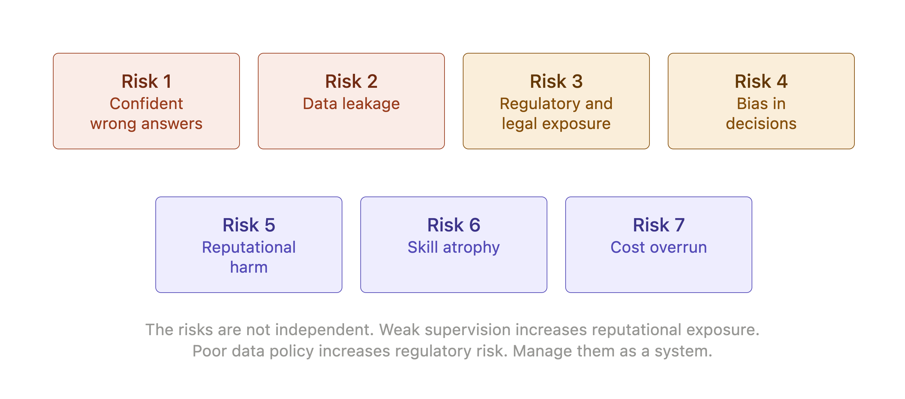
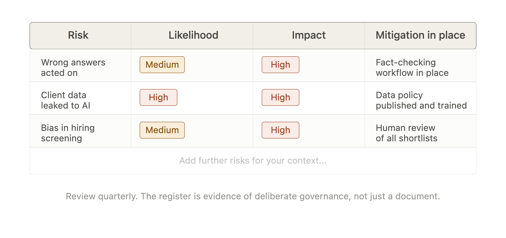
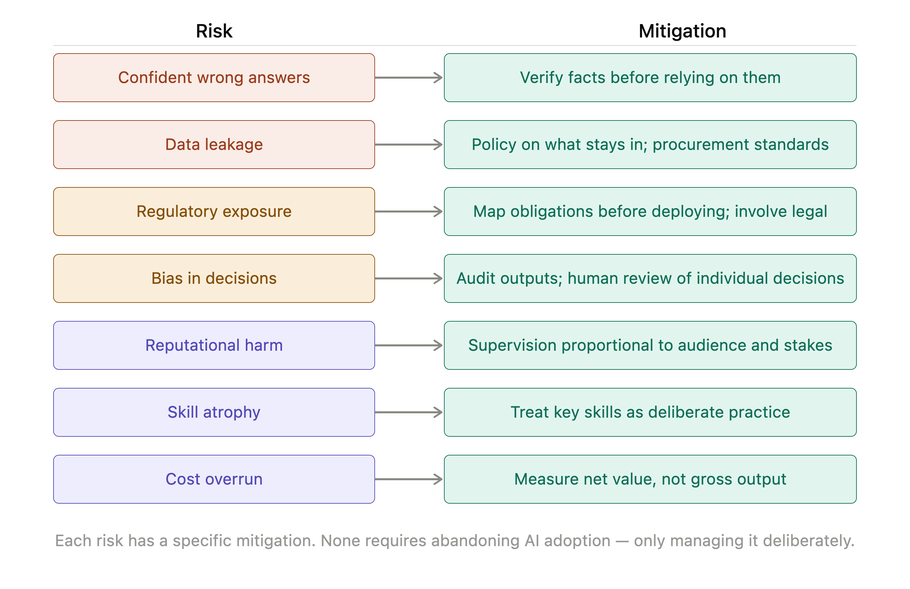

# Chapter 4: What Can Go Wrong

Every technology that enters organizational life brings new failure modes. Some are obvious before they arrive. Most are not. Generative AI has been in widespread organizational use long enough that the failure modes are now reasonably well understood - which puts managers in the unusual position of being able to prepare for them before encountering them firsthand.

This chapter maps seven risks that any organization using generative AI needs to manage. They are not theoretical. Each has been observed in real organizations and in some cases has caused real harm. Understanding them does not guarantee they will be avoided, but it makes avoidance considerably more likely.

*Figure 4-1. The Seven Risks.*

## Risk 1: Confident Wrong Answers

The intern produces confident, fluent, well-structured output regardless of whether that output is accurate. This is not a design flaw that will be corrected in a future version. It is a consequence of how large language models work: they predict plausible continuations of text rather than retrieving verified facts. The confidence is a property of the prose, not a signal of accuracy.

The risk this creates is specific. A manager who receives a plausible-sounding briefing document, a confident market analysis or a detailed competitive summary may act on it without checking. The document looks authoritative. The figures are specific. The argument is coherent. Only on investigation does it become clear that some of the figures were invented, that the case law cited does not exist or that the competitor described never launched the product in question.

The mitigation is not to distrust everything the intern produces. It is to distinguish between outputs that require verification and those that do not and to build verification into the workflow for the former. Factual claims, specific figures, legal references and any assertion that will be relied upon by someone who has not also checked it independently belong in the first category.

> **MARGIN - Verify Before You Rely**
> *The intern's confidence is a property of the prose, not a signal of accuracy. Any specific claim that will be acted upon or passed to someone else needs to be checked against a primary source. Build verification into the workflow, not the review process.*

## Risk 2: Data Leakage

When a manager or employee pastes information into an AI system, that information leaves the organization's controlled environment. What happens to it depends entirely on the policies of the AI provider - which vary considerably and change over time. In some configurations, inputs are used to train future models. In others, they are logged and retained. In still others, they are discarded immediately.

The risk is that sensitive information - client data, commercial terms, unreleased financial results, personal data covered by privacy regulation, strategic plans - is shared with an external system whose data handling practices may not meet the organization's obligations. The fact that the output was useful does not mean the input was safe to provide.

The mitigation has two parts. The first is policy: establishing clear organizational guidance on what categories of information may and may not be pasted into AI systems and ensuring that guidance is understood and followed. The second is procurement: selecting AI tools based on their data handling commitments and ensuring those commitments are reflected in contracts.

> **MARGIN - What Stays In**
> *Not everything belongs in a brief to your Digital Intern. Client data, unreleased financials, personal data and strategic plans require clear policy guidance before they go anywhere near an external AI system. Set the policy before the incident, not after.*

## Risk 3: Regulatory and Legal Exposure

Generative AI intersects with a growing body of regulation in ways that are still being mapped. The areas of current concern include data protection and privacy, intellectual property, financial advice and product regulations, employment law and sector-specific requirements in areas including healthcare, legal services and financial services.

The exposure is not hypothetical. Organizations that use AI-generated content in customer communications may have obligations around disclosure. Those that use AI in hiring or performance management may face employment law questions. Those that use AI to generate advice in regulated sectors may find that the advice attracts regulatory scrutiny regardless of whether a human signed off on it.

The mitigation is not to avoid AI in regulated contexts - its usefulness in those contexts is real. The mitigation is to map the regulatory intersections before deploying AI in a new context and to involve legal counsel in that mapping. The question to ask is not "is this output useful?" but "what obligations does producing this output in this context create?"

> **MARGIN - Map Before You Deploy**
> *Before using AI in a new context - customer communications, hiring, advice, regulated sectors - ask what regulatory obligations that context creates. Involve legal counsel. The question is not whether the output is useful but whether producing it creates exposure.*

## Risk 4: Bias in Decisions

Large language models learn from text and text reflects the biases present in the society that produced it. This means that AI outputs can carry and amplify biases related to gender, ethnicity, age, geography and other characteristics - often without those biases being visible in the output itself.

The risk is highest when AI is used to support decisions that affect individuals: screening resumes, assessing performance, approving credit, allocating opportunities. An AI system that systematically produces outputs that disadvantage members of a particular group is causing harm even if no individual act of discrimination was intended. In many jurisdictions it is also illegal, regardless of intent.

The mitigation requires deliberate intervention. Organizations using AI in decisions that affect individuals need to audit those outputs for bias, to design processes that include human review of individual decisions and to maintain records that allow patterns to be identified and corrected. The intern does not know it is being biased. The manager does not always know either. The only reliable check is systematic monitoring.

> **MARGIN - Audit What Affects People**
> *Any AI output used in a decision that affects an individual - hiring, performance, credit, access - needs systematic monitoring for bias. The intern does not know it is producing biased output. The manager cannot assume it is not.*

## Risk 5: Reputational Harm

AI systems can produce output that is embarrassing, offensive, factually wrong or legally problematic - and they can produce it at scale, faster than human review can catch it. The reputational risk is not from the one document that gets checked before it goes out. It is from the thousand that do not.

The risk compounds when AI is used in external-facing contexts: customer communications, public statements, marketing materials, social media. A single widely-shared example of AI-produced content that is offensive or inaccurate can cause reputational damage disproportionate to the incident that produced it.

The mitigation is to maintain proportionate oversight for the stakes involved. Customer-facing content generated by AI requires human review before publication. High-volume, low-stakes internal content can tolerate lighter oversight. The supervision level should reflect the reputational consequence of a mistake reaching its destination.

> **MARGIN - Stakes Scale with Audience**
> *The reputational stakes of AI output are proportional to how many people see it and who they are. Customer-facing content needs human review. Internal drafts have more tolerance for error. Set supervision accordingly.*

## Risk 6: Dependency and Skill Atrophy

Organizations that delegate too much to AI too quickly risk losing the human skills that gave the AI outputs their value. A team that has stopped drafting documents from scratch gradually loses its ability to recognize when a draft is poor. A manager who has stopped analyzing data independently gradually loses the judgment needed to know when an analysis is wrong.

This is not an argument against AI adoption. It is an argument for managed adoption. The value of AI output depends partly on the human judgment applied to it. If that judgment atrophies because it is no longer exercised, the value of the output declines with it - while the confidence in the output may not.

The mitigation is to treat certain skills as deliberate practice rather than optional overhead. Teams that use AI to draft should still occasionally draft independently. Managers who use AI to analyze should still occasionally analyze the underlying data. The intern should augment the team's capability, not replace the capability with dependence.

> **MARGIN - Keep the Skill**
> *The judgment that makes AI output valuable is yours, not the intern's. If you stop exercising it, you lose it - and the output quality declines with it, even if you do not notice immediately. Deliberate practice is not inefficiency; it is maintenance.*

## Risk 7: Cost Overrun

AI tools are not free, and the costs are not always obvious at the point of adoption. Direct costs include API usage fees that scale with volume, subscription costs for tools and platforms and the cost of storage and infrastructure. Indirect costs include the management time spent on oversight, the cost of errors that reach their destination and the cost of building and maintaining the organizational processes that AI requires.

The risk is that organizations adopt AI on the basis of the productivity gains it promises, without adequately accounting for the costs it introduces. A team that uses AI to produce ten times as much output is not necessarily ten times as productive if the cost of oversight, correction and quality management rises in proportion.

The mitigation is to build realistic cost models before scaling AI use, to monitor actual costs against projections, and to evaluate AI initiatives on net value rather than gross output. The intern's productivity is genuine. So is the cost of supervising them.

> **MARGIN - Net Value, Not Gross Output**
> *The value of AI adoption is the net gain after costs - including oversight, correction and management time. Measure it that way. A tool that produces ten times the output at ten times the oversight cost has broken even, not transformed the business.*

## Managing the Seven Risks Together

The seven risks are not independent. An organization with inadequate supervision (Risk 1) is also more exposed to reputational harm (Risk 5). An organization that has not set data policy (Risk 2) may also face regulatory exposure (Risk 3). A team that has allowed skill atrophy (Risk 6) is less able to detect confident wrong answers (Risk 1).

Managing these risks well requires treating them as a system rather than a checklist. A risk register that documents each risk, its likelihood in your specific context, its potential impact and the mitigations in place gives an organization a basis for prioritization. It also gives a board the evidence that AI adoption is being managed thoughtfully - which is increasingly what boards want to see.

The goal is not to eliminate risk. AI adoption involves genuine uncertainty and some level of risk is unavoidable. The goal is to take risk deliberately, with awareness of what you are accepting and why, rather than by default.

*Figure 4-2. Risk Register.*

> **MARGIN - The Risk Register**
> *Document the seven risks, their likelihood in your context, their potential impact and your mitigations. Review it quarterly. It is not just good governance - it is the evidence that you are making deliberate choices rather than hoping for the best.*

*Figure 4-3. Risk and Mitigation Pairs.*

## Chapter Summary

- Generative AI introduces seven manageable risks: confident wrong answers, data leakage, regulatory exposure, bias in decisions, reputational harm, skill atrophy and cost overrun.
- Each risk has a specific mitigation. None requires abandoning AI adoption - they require managing it deliberately.
- The risks interact. Weak supervision increases reputational exposure. Poor data policy increases regulatory risk. Skill atrophy reduces the value of AI output over time.
- A risk register that documents likelihood, impact and mitigation gives organizations a basis for prioritization and gives boards evidence of thoughtful governance.
- The goal is deliberate risk-taking, not risk elimination.

*Next: Chapter 5 - The Accountability Conversation: When the Board Asks Why*
